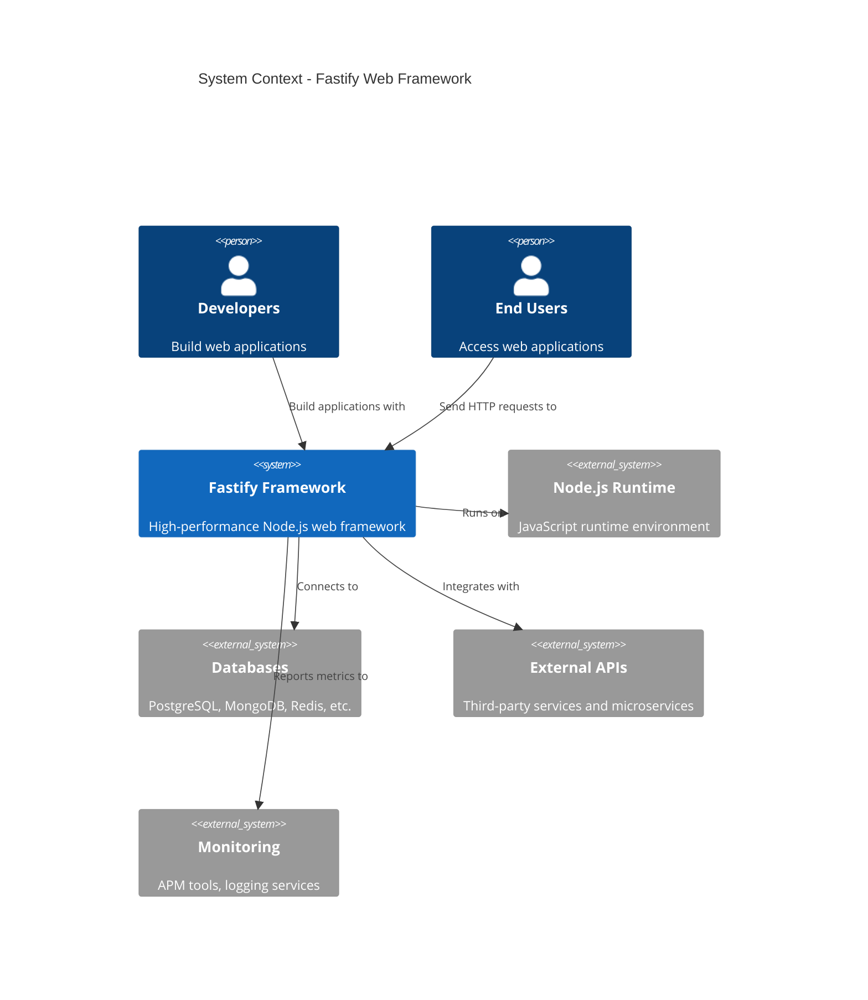

# Fastify

Fast and low overhead web framework for Node.js

[](https://www.npmjs.com/package/fastify)
[](https://github.com/fastify/fastify/actions)
[](https://coveralls.io/github/fastify/fastify?branch=main)
[](https://opensource.org/licenses/MIT)
[](https://nodejs.org/)

## What It Does

- **High Performance**: One of the fastest Node.js web frameworks available, built for speed and low overhead
- **JSON Schema Validation**: Built-in request and response validation using JSON schemas for type safety
- **Plugin Architecture**: Extensible plugin system with encapsulation and lifecycle management
- **Developer Experience**: TypeScript support, comprehensive logging, and detailed error messages
- **Protocol Support**: Full support for HTTP/1.1, HTTP/2, and HTTPS out of the box

## Architecture Overview



## Quick Start

1. **Create a new project**:
   ```bash
   mkdir my-fastify-app && cd my-fastify-app
   npm init -y
   ```

2. **Install Fastify**:
   ```bash
   npm install fastify
   ```

3. **Create your first server** (`server.js`):
   ```javascript
   const fastify = require('fastify')({ logger: true })

   fastify.get('/', async (request, reply) => {
     return { hello: 'world' }
   })

   const start = async () => {
     try {
       await fastify.listen({ port: 3000 })
       console.log('Server listening on http://localhost:3000')
     } catch (err) {
       fastify.log.error(err)
       process.exit(1)
     }
   }
   start()
   ```

4. **Run your server**:
   ```bash
   node server.js
   ```

5. **Test your API**:
   ```bash
   curl http://localhost:3000
   ```

## Usage

Here's the most common use case - creating a REST API with validation:

```javascript
const fastify = require('fastify')({ logger: true })

// Define a schema for validation
const userSchema = {
  schema: {
    body: {
      type: 'object',
      properties: {
        name: { type: 'string' },
        email: { type: 'string', format: 'email' }
      },
      required: ['name', 'email']
    },
    response: {
      200: {
        type: 'object',
        properties: {
          id: { type: 'number' },
          name: { type: 'string' },
          email: { type: 'string' }
        }
      }
    }
  }
}

// Register routes
fastify.post('/users', userSchema, async (request, reply) => {
  const { name, email } = request.body
  // Your business logic here
  return { id: 123, name, email }
})

fastify.get('/users/:id', async (request, reply) => {
  const { id } = request.params
  return { id, name: 'John Doe', email: 'john@example.com' }
})

// Start the server
fastify.listen({ port: 3000, host: '0.0.0.0' })
```

## Configuration

| Option | Type | Default | Description |
|--------|------|---------|-------------|
| `logger` | `boolean \| object` | `false` | Enable logging with Pino logger |
| `bodyLimit` | `number` | `1048576` | Maximum size of request body in bytes (1MB) |
| `caseSensitive` | `boolean` | `true` | Case sensitive routing |
| `ignoreTrailingSlash` | `boolean` | `false` | Ignore trailing slashes in routes |
| `maxParamLength` | `number` | `100` | Maximum length of route parameters |
| `trustProxy` | `boolean \| string \| number` | `false` | Trust proxy headers |
| `pluginTimeout` | `number` | `60000` | Plugin loading timeout in milliseconds |
| `querystringParser` | `function` | `qs.parse` | Custom querystring parser |
| `genReqId` | `function` | Auto-generated | Custom request ID generator |
| `requestIdHeader` | `string` | `"request-id"` | Request ID header name |

## Project Structure

```
fastify/
├── fastify.js              # Main framework entry point
├── fastify.d.ts           # TypeScript definitions
├── lib/                   # Core framework modules
│   ├── server.js          # HTTP server creation and management
│   ├── reply.js           # Response handling and serialization
│   ├── request.js         # Request parsing and processing
│   ├── route.js           # Routing engine and middleware
│   ├── hooks.js           # Lifecycle hooks system
│   ├── validation.js      # JSON schema validation
│   ├── content-type-parser.js # Content type parsing
│   └── ...               # Additional core modules
├── types/                 # TypeScript type definitions
├── examples/              # Usage examples and demos
├── test/                  # Comprehensive test suite
├── integration/           # Integration tests
└── build/                 # Build and validation scripts
```

## Documentation

| Section | Description |
|---------|-------------|
| [Getting Started](docs/getting-started/) | Installation and first steps |
| [Guides](docs/guides/) | Task-oriented how-to guides |
| [Reference](docs/reference/) | API reference, CLI, configuration |
| [Architecture](docs/explanation/architecture.md) | System design and decisions |

## Dependencies

| Package | Version | Purpose |
|---------|---------|---------|
| `avvio` | `^9.0.0` | Plugin loading and lifecycle management |
| `find-my-way` | `^9.0.0` | High-performance router |
| `fast-json-stringify` | `^6.0.0` | Fast JSON serialization |
| `@fastify/ajv-compiler` | `^4.0.5` | JSON schema validation compiler |
| `pino` | `^9.14.0 \|\| ^10.1.0` | High-performance JSON logger |
| `light-my-request` | `^6.0.0` | HTTP request injection for testing |
| `secure-json-parse` | `^4.0.0` | Secure JSON parsing |

## Contributing

We welcome contributions! To get started:

1. Fork the repository
2. Create a feature branch: `git checkout -b feature/my-feature`
3. Make your changes and add tests
4. Run the test suite: `npm test`
5. Commit your changes: `git commit -m 'Add some feature'`
6. Push to your branch: `git push origin feature/my-feature`
7. Open a Pull Request

Please ensure your code follows our style guidelines and includes appropriate tests.

## License

[MIT License](LICENSE) - Copyright (c) 2016-present The Fastify team