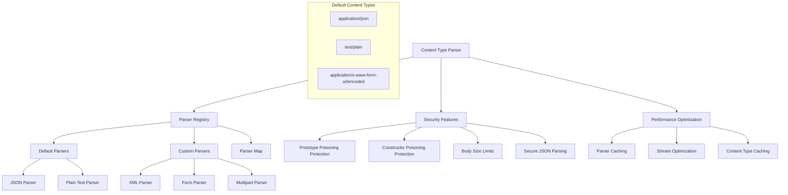
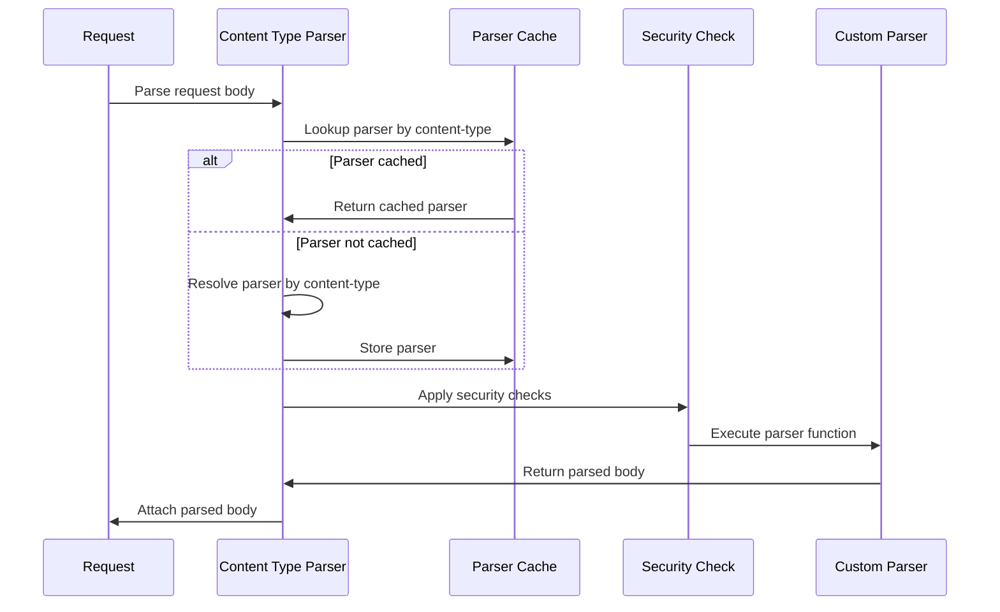
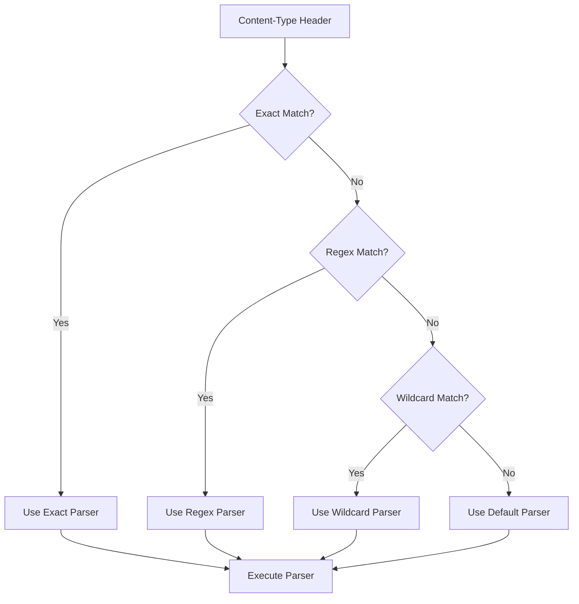

# Content Type Parser Module

Request body parsing by content type with security features and performance optimizations.

## Module Structure



## Public API

| Function | Parameters | Returns | Description |
|----------|------------|---------|-------------|
| `ContentTypeParser` | `bodyLimit, onProtoPoisoning, onConstructorPoisoning` | `Object` | Constructor for content type parser |
| `add` | `contentType, options, parser` | `void` | Add custom content type parser |
| `remove` | `contentType` | `void` | Remove content type parser |
| `has` | `contentType` | `boolean` | Check if parser exists |
| `getParser` | `contentType` | `Function` | Get parser for content type |
| `run` | `contentType, request, payload` | `Promise` | Execute parser for content type |

## Key Types

| Type | Properties | Description |
|------|------------|-------------|
| `Parser` | `fn, bodyLimit, parseAs` | Parser configuration object |
| `ParseOptions` | `parseAs, bodyLimit` | Parser execution options |
| `ParserFunction` | `request, payload, done` | Custom parser function signature |

## Usage Example

```javascript
// Add custom XML parser
fastify.addContentTypeParser('application/xml', { parseAs: 'string' }, function (req, body, done) {
  try {
    const xml = require('xml2js')
    xml.parseString(body, done)
  } catch (err) {
    done(err)
  }
})

// Add form data parser with custom body limit
fastify.addContentTypeParser('application/x-www-form-urlencoded', {
  bodyLimit: 1000000 // 1MB
}, function (req, body, done) {
  const qs = require('querystring')
  try {
    const parsed = qs.parse(body.toString())
    done(null, parsed)
  } catch (err) {
    done(err)
  }
})

// Add binary parser
fastify.addContentTypeParser('application/octet-stream', { parseAs: 'buffer' }, function (req, body, done) {
  // body is already a Buffer
  done(null, body)
})

// Conditional parser based on request
fastify.addContentTypeParser(['text/xml', 'application/xml'], function (req, body, done) {
  if (req.headers['x-legacy-format']) {
    // Handle legacy XML format
    done(null, parseLegacyXML(body))
  } else {
    done(null, parseModernXML(body))
  }
})
```

## Dependencies

| Dependency | Type | Purpose |
|------------|------|---------|
| `secure-json-parse` | External | Secure JSON parsing with prototype protection |
| `toad-cache` | External | LRU cache for parser lookup optimization |
| `node:async_hooks` | Built-in | Async context preservation |
| `./content-type` | Internal | Content-Type header parsing utilities |

## Configuration

| Option | Type | Default | Description |
|--------|------|---------|-------------|
| `bodyLimit` | `number` | `1048576` | Maximum body size in bytes (1MB) |
| `parseAs` | `string` | `'buffer'` | Parse format: 'buffer', 'string', or 'stream' |
| `onProtoPoisoning` | `string` | `'error'` | Action on prototype poisoning: 'error', 'remove', 'ignore' |
| `onConstructorPoisoning` | `string` | `'error'` | Action on constructor poisoning: 'error', 'remove', 'ignore' |

## Parsing Flow



## Security Features

| Feature | Protection Against | Configuration |
|---------|-------------------|---------------|
| **Prototype Poisoning** | `__proto__` attacks | `onProtoPoisoning: 'error'` |
| **Constructor Poisoning** | `constructor` attacks | `onConstructorPoisoning: 'error'` |
| **JSON Depth Limit** | Deep object attacks | Built into secure-json-parse |
| **Body Size Limit** | DoS via large payloads | `bodyLimit` option |
| **Content-Type Validation** | Invalid MIME types | Automatic validation |

## Default Parsers

| Content-Type | Parser | Parse As | Body Limit |
|-------------|--------|----------|------------|
| `application/json` | secure-json-parse | `string` | Global default |
| `text/plain` | Built-in | `string` | Global default |

## Parser Resolution



## Performance Optimizations

| Feature | Benefit | Implementation |
|---------|---------|----------------|
| **Parser Caching** | Avoid parser lookup | LRU cache with content-type as key |
| **Content-Type Normalization** | Consistent matching | Lowercase and trim content-type |
| **Regex Compilation** | Fast pattern matching | Pre-compiled regex patterns |
| **Stream Processing** | Memory efficiency | Direct stream processing for large bodies |
| **Body Reuse** | Reduce allocations | Buffer reuse for similar requests |