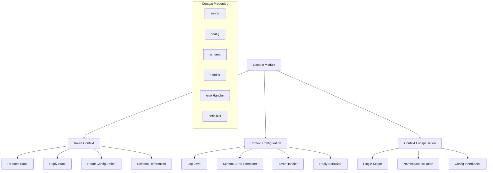
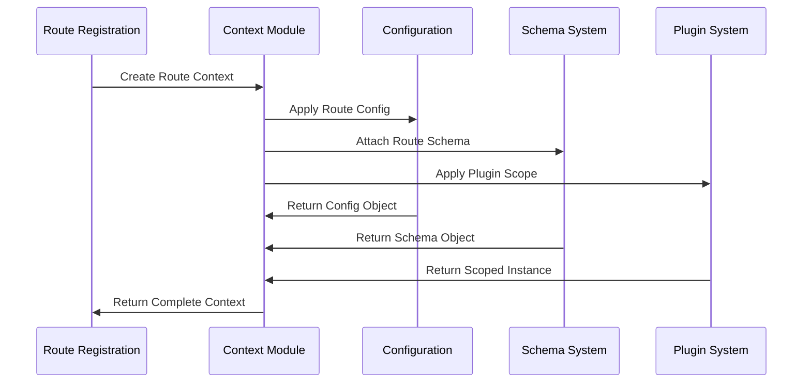
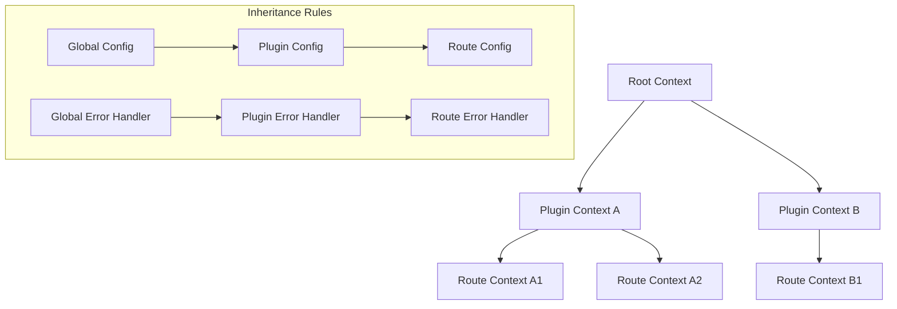
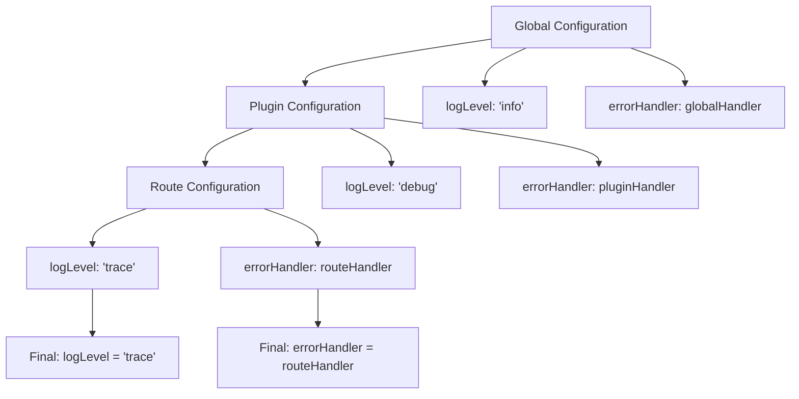

# Context Module

Request-scoped dependency injection and route execution context management providing isolated state for each route.

## Module Structure



## Public API

| Function/Property | Parameters | Returns | Description |
|-------------------|------------|---------|-------------|
| `Context` | `server, config, schema, handler, store` | `Context` | Constructor for route context |
| `server` | None | `FastifyInstance` | Reference to Fastify server instance |
| `config` | None | `Object` | Route-specific configuration |
| `schema` | None | `Object` | Route schema definition |
| `handler` | None | `Function` | Route handler function |
| `errorHandler` | None | `Function` | Context-specific error handler |
| `serializer` | None | `Function` | Context-specific response serializer |

## Key Types

| Type | Properties | Description |
|------|------------|-------------|
| `RouteContext` | `server, config, schema, handler` | Complete route execution context |
| `ContextConfig` | `logLevel, errorHandler, serializer` | Context configuration options |
| `ContextStore` | `[key: string]: any` | Key-value store for context data |

## Usage Example

```javascript
// Context is created automatically during route registration
// but can be customized through route options

fastify.get('/users/:id', {
  // Route-specific configuration
  config: {
    rateLimit: {
      max: 100,
      timeWindow: '1 minute'
    }
  },
  // Route-specific error handler
  errorHandler: (error, request, reply) => {
    if (error.code === 'RATE_LIMIT_EXCEEDED') {
      return reply.code(429).send({
        error: 'Too Many Requests',
        retryAfter: error.retryAfter
      })
    }
    throw error
  },
  // Route-specific serializer
  serializer: (payload) => {
    // Custom serialization logic
    return JSON.stringify(payload, null, 2)
  },
  schema: {
    params: {
      type: 'object',
      properties: {
        id: { type: 'string' }
      }
    }
  }
}, async (request, reply) => {
  // Access context through request/reply
  const config = request.routeConfig
  const schema = request.routeSchema
  
  return { userId: request.params.id }
})

// Plugin-scoped context
fastify.register(async function (fastify) {
  // This context is isolated to this plugin
  fastify.get('/plugin-route', async (request, reply) => {
    // Has access to plugin-specific decorators and config
    return { message: 'Plugin route' }
  })
})
```

## Dependencies

| Dependency | Type | Purpose |
|------------|------|---------|
| None | None | Self-contained context system |

## Context Creation Flow



## Context Inheritance



## Context Isolation

| Scope Level | Access | Isolation | Example |
|-------------|--------|-----------|---------|
| **Global** | All routes | None | Global error handler |
| **Plugin** | Plugin routes only | Plugin boundary | Plugin-specific decorators |
| **Route** | Single route | Route boundary | Route-specific config |
| **Request** | Single request | Request boundary | Request-scoped state |

## Configuration Inheritance



## Context State Management

| State Type | Scope | Lifetime | Access Pattern |
|------------|-------|----------|----------------|
| **Route Context** | Per route registration | Application lifetime | `request.routeContext` |
| **Request Context** | Per request | Request lifetime | `request.context` |
| **Plugin Context** | Per plugin | Plugin lifetime | Plugin encapsulation |
| **Server Context** | Global | Server lifetime | `fastify` instance |

## Memory Management

| Aspect | Strategy | Benefit |
|--------|----------|---------|
| **Context Reuse** | Singleton per route | Reduced allocations |
| **Config Caching** | Immutable config objects | Memory efficiency |
| **Schema References** | Shared schema objects | Deduplication |
| **Handler Binding** | Pre-bound functions | Performance optimization |

## Context Access Patterns

```javascript
// Access context from route handler
fastify.get('/example', async (request, reply) => {
  const routeConfig = request.routeConfig
  const routeSchema = request.routeSchema
  const serverInstance = request.server
})

// Access context from hooks
fastify.addHook('preHandler', async (request, reply) => {
  const context = request.routeContext
  const config = context.config
})

// Access context from decorators
fastify.decorate('customMethod', function() {
  // 'this' is the Fastify instance (server context)
  return this.someProperty
})
```