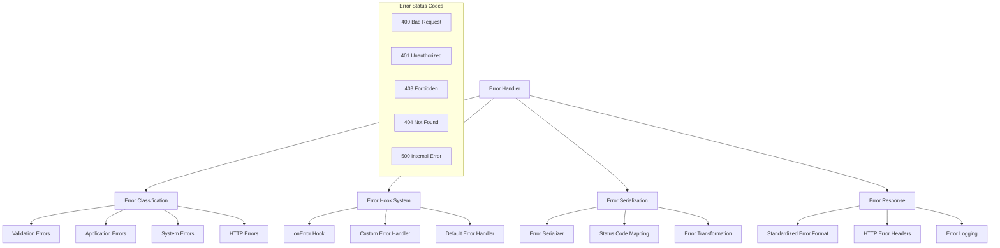
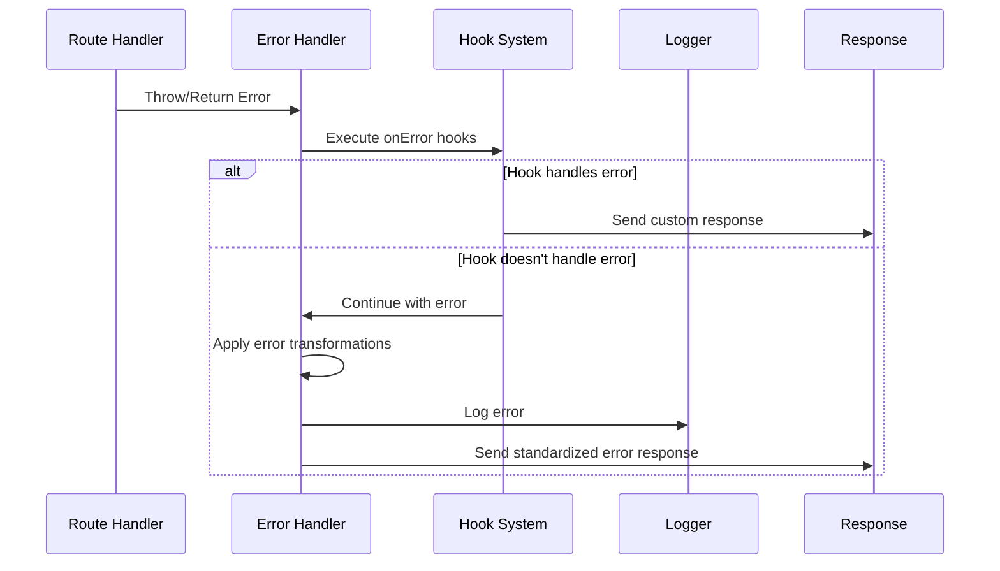
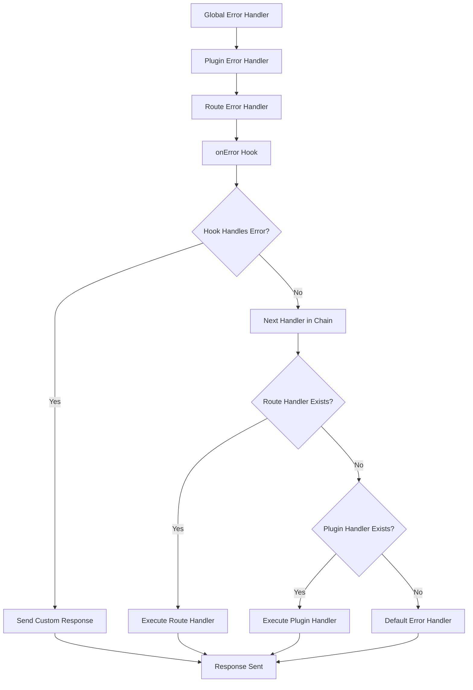
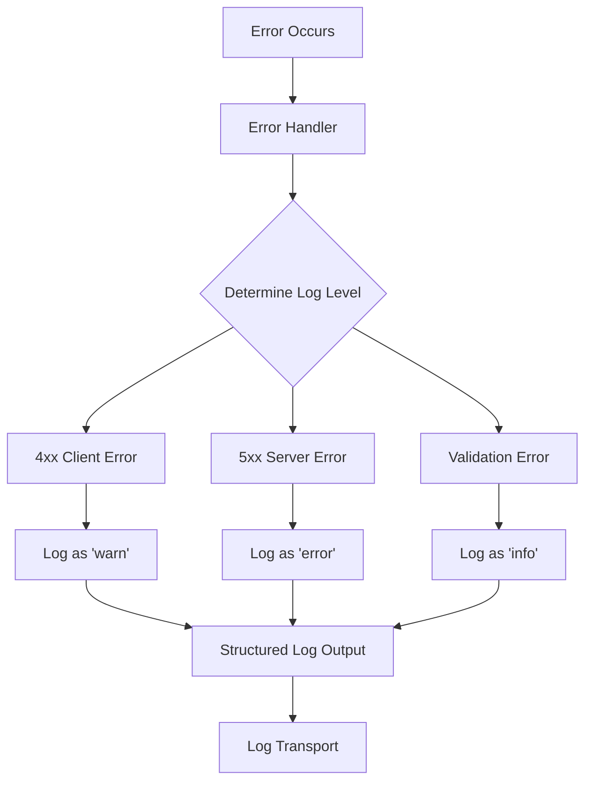

# Error Handler Module

Error processing and response formatting system with customizable error handling and automatic error serialization.

## Module Structure



## Public API

| Function | Parameters | Returns | Description |
|----------|------------|---------|-------------|
| `handleError` | `error, request, reply` | `Promise` | Main error handling entry point |
| `defaultErrorHandler` | `error, request, reply` | `void` | Default error processing logic |
| `setErrorHandler` | `handler` | `void` | Set custom error handler |
| `errorHandler` | `error, request, reply` | `Promise` | Execute error handler chain |

## Key Types

| Type | Properties | Description |
|------|------------|-------------|
| `FastifyError` | `statusCode, code, message, validation` | Fastify-specific error object |
| `ErrorHandler` | `(error, request, reply)` → `void` | Error handler function signature |
| `ErrorResponse` | `statusCode, error, message` | Standard error response format |
| `ValidationError` | `validation, schemaPath, keyword` | JSON schema validation error |

## Usage Example

```javascript
// Global error handler
fastify.setErrorHandler(async (error, request, reply) => {
  // Log error
  request.log.error(error)
  
  // Handle specific error types
  if (error.code === 'RATE_LIMIT_EXCEEDED') {
    return reply.code(429).send({
      error: 'Too Many Requests',
      message: 'Rate limit exceeded',
      retryAfter: error.retryAfter
    })
  }
  
  if (error.validation) {
    return reply.code(400).send({
      error: 'Validation Error',
      message: 'Request validation failed',
      details: error.validation
    })
  }
  
  // Default error response
  return reply.code(error.statusCode || 500).send({
    error: error.name || 'Internal Server Error',
    message: error.message
  })
})

// Route-specific error handler
fastify.get('/users/:id', {
  errorHandler: async (error, request, reply) => {
    if (error.code === 'USER_NOT_FOUND') {
      return reply.code(404).send({
        error: 'Not Found',
        message: `User ${request.params.id} not found`
      })
    }
    // Fall back to global error handler
    throw error
  }
}, async (request, reply) => {
  const user = await getUserById(request.params.id)
  if (!user) {
    const error = new Error('User not found')
    error.code = 'USER_NOT_FOUND'
    throw error
  }
  return user
})

// Custom error class
class CustomError extends Error {
  constructor(message, statusCode = 500) {
    super(message)
    this.name = 'CustomError'
    this.statusCode = statusCode
  }
}

// Throwing custom errors
fastify.get('/protected', async (request, reply) => {
  if (!request.headers.authorization) {
    throw new CustomError('Authorization required', 401)
  }
  return { message: 'Protected content' }
})
```

## Dependencies

| Dependency | Type | Purpose |
|------------|------|---------|
| `./errors` | Internal | Fastify-specific error classes |
| `./hooks` | Internal | Error hook execution |
| None | External | Self-contained error system |

## Error Handling Flow



## Error Classification

| Error Type | Status Code | Auto-Generated | Example |
|------------|-------------|----------------|---------|
| **Validation Error** | 400 | ✓ | JSON schema validation failure |
| **Not Found Error** | 404 | ✓ | Route not found |
| **Method Not Allowed** | 405 | ✓ | Unsupported HTTP method |
| **Payload Too Large** | 413 | ✓ | Request body exceeds limit |
| **Unsupported Media Type** | 415 | ✓ | Unknown content-type |
| **Application Error** | 500 | ✗ | Custom business logic errors |

## Standard Error Response Format

```json
{
  "statusCode": 400,
  "error": "Bad Request",
  "message": "body.email should match format \"email\"",
  "validation": [
    {
      "keyword": "format",
      "dataPath": ".email", 
      "schemaPath": "#/properties/email/format",
      "params": {
        "format": "email"
      },
      "message": "should match format \"email\""
    }
  ]
}
```

## Error Handler Hierarchy



## Built-in Error Classes

| Class | Status Code | Description |
|-------|-------------|-------------|
| `FST_ERR_VALIDATION` | 400 | JSON schema validation failed |
| `FST_ERR_NOT_FOUND` | 404 | Route not found |
| `FST_ERR_BAD_URL` | 400 | Malformed URL |
| `FST_ERR_METHOD_NOT_ALLOWED` | 405 | HTTP method not supported |
| `FST_ERR_BAD_REQUEST` | 400 | Generic bad request |
| `FST_ERR_ROUTE_DUPLICATED` | 500 | Duplicate route registration |

## Error Logging Integration



## Performance Considerations

| Aspect | Impact | Best Practice |
|--------|--------|---------------|
| **Error Object Creation** | Memory allocation | Reuse error instances where possible |
| **Stack Trace Capture** | CPU overhead | Only in development/debug mode |
| **Error Serialization** | CPU + Memory | Pre-compile common error responses |
| **Hook Execution** | Latency | Keep error hooks lightweight |
| **Logging Volume** | I/O overhead | Use appropriate log levels |

## Custom Error Response Examples

```javascript
// Business logic error
class BusinessLogicError extends Error {
  constructor(message, details = {}) {
    super(message)
    this.name = 'BusinessLogicError'
    this.statusCode = 422
    this.details = details
  }
}

// Database error
class DatabaseError extends Error {
  constructor(message, query = null) {
    super(message)
    this.name = 'DatabaseError'
    this.statusCode = 500
    this.query = query
  }
}

// Authentication error
class AuthenticationError extends Error {
  constructor(message = 'Authentication required') {
    super(message)
    this.name = 'AuthenticationError'
    this.statusCode = 401
  }
}
```