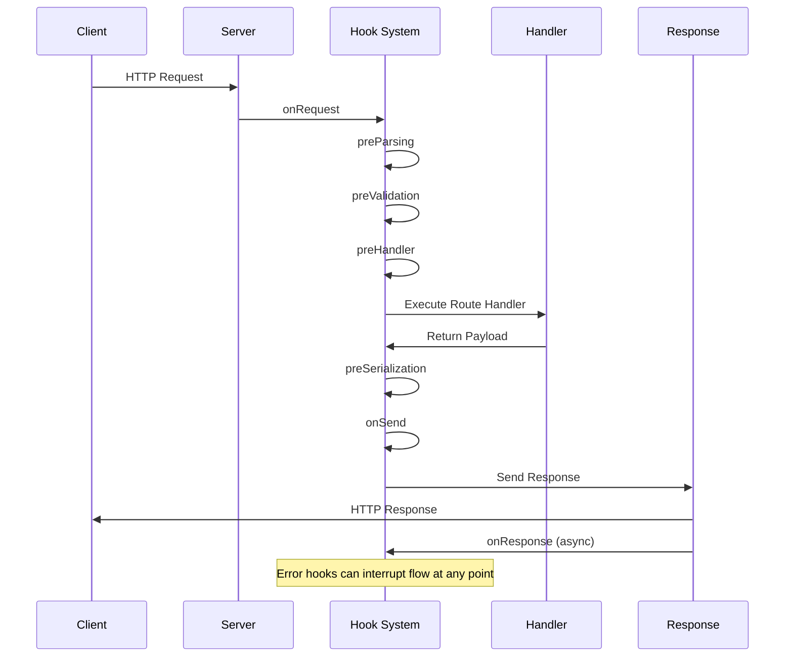
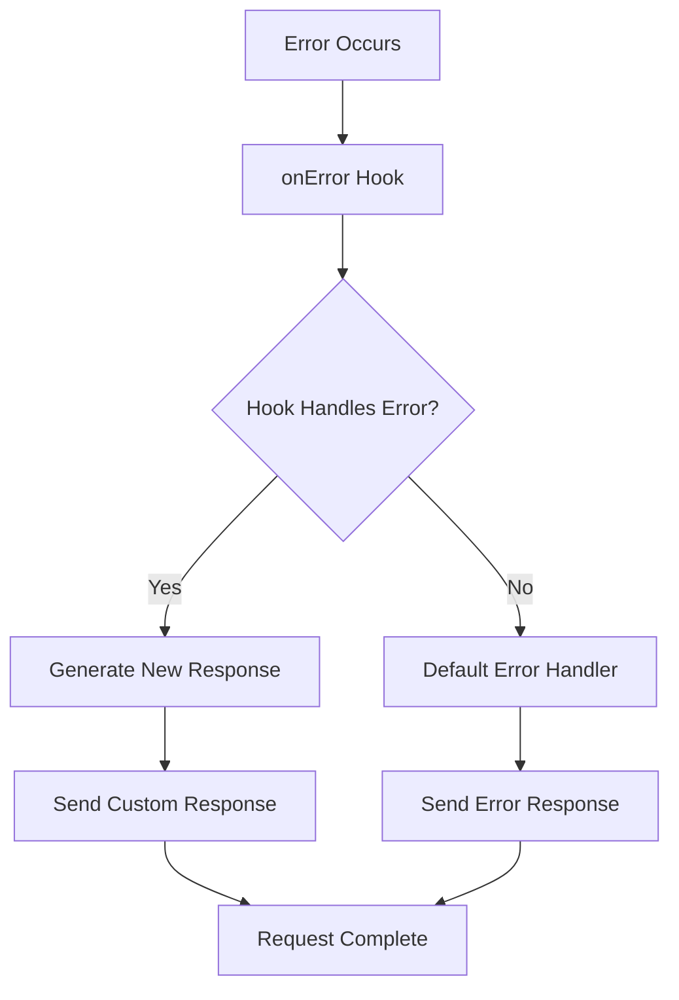

# Hooks Module

Lifecycle hooks and event management system providing extensible request/response processing pipeline.

## Module Structure

```mermaid
flowchart TD
    Hooks[Hooks System] --> ApplicationHooks[Application Hooks]
    Hooks --> LifecycleHooks[Lifecycle Hooks]
    Hooks --> HookRunners[Hook Runners]
    
    ApplicationHooks --> OnRoute[onRoute]
    ApplicationHooks --> OnRegister[onRegister]
    ApplicationHooks --> OnReady[onReady]
    ApplicationHooks --> OnListen[onListen]
    ApplicationHooks --> PreClose[preClose]
    ApplicationHooks --> OnClose[onClose]
    
    LifecycleHooks --> OnRequest[onRequest]
    LifecycleHooks --> PreParsing[preParsing]
    LifecycleHooks --> PreValidation[preValidation]
    LifecycleHooks --> PreHandler[preHandler]
    LifecycleHooks --> PreSerialization[preSerialization]
    LifecycleHooks --> OnSend[onSend]
    LifecycleHooks --> OnResponse[onResponse]
    LifecycleHooks --> OnError[onError]
    LifecycleHooks --> OnTimeout[onTimeout]
    LifecycleHooks --> OnRequestAbort[onRequestAbort]
    
    HookRunners --> Sequential[Sequential Execution]
    HookRunners --> ErrorHandling[Error Handling]
    HookRunners --> Async[Async Support]
```



## Public API

| Function | Parameters | Returns | Description |
|----------|------------|---------|-------------|
| `Hooks` | None | `Object` | Constructor for hooks container |
| `addHook` | `name, handler` | `void` | Add hook handler |
| `onRequestHookRunner` | `request, reply` | `Promise` | Execute onRequest hooks |
| `preParsingHookRunner` | `request, reply` | `Promise` | Execute preParsing hooks |
| `preValidationHookRunner` | `request, reply` | `Promise` | Execute preValidation hooks |
| `preHandlerHookRunner` | `request, reply` | `Promise` | Execute preHandler hooks |
| `preSerializationHookRunner` | `request, reply, payload` | `Promise` | Execute preSerialization hooks |
| `onSendHookRunner` | `request, reply, payload` | `Promise` | Execute onSend hooks |
| `onResponseHookRunner` | `request, reply` | `Promise` | Execute onResponse hooks |
| `onErrorHookRunner` | `error, request, reply` | `Promise` | Execute onError hooks |

## Hook Types

### Application Hooks

| Hook | Trigger Point | Use Case |
|------|---------------|----------|
| `onRoute` | Route registration | Route modification, logging |
| `onRegister` | Plugin registration | Plugin lifecycle management |
| `onReady` | Server ready | Database connections, setup |
| `onListen` | Server listening | Startup notifications |
| `preClose` | Before server close | Graceful shutdown preparation |
| `onClose` | Server closing | Cleanup, resource deallocation |

### Lifecycle Hooks

| Hook | Request Phase | Modifications Allowed |
|------|---------------|----------------------|
| `onRequest` | Request start | Request object decoration |
| `preParsing` | Before body parsing | Request stream modification |
| `preValidation` | Before validation | Request data transformation |
| `preHandler` | Before route handler | Final request preparation |
| `preSerialization` | Before response serialization | Payload modification |
| `onSend` | Before response send | Response transformation |
| `onResponse` | After response sent | Logging, metrics |
| `onError` | Error occurred | Error handling, logging |

## Usage Example

```javascript
// Application lifecycle hooks
fastify.addHook('onReady', async () => {
  console.log('Server is ready')
})

fastify.addHook('onClose', async () => {
  console.log('Server is closing')
  await database.close()
})

// Request lifecycle hooks
fastify.addHook('onRequest', async (request, reply) => {
  request.startTime = Date.now()
})

fastify.addHook('preHandler', async (request, reply) => {
  // Authentication check
  if (!request.headers.authorization) {
    throw new Error('Missing authorization')
  }
})

fastify.addHook('onResponse', async (request, reply) => {
  const duration = Date.now() - request.startTime
  console.log(`Request took ${duration}ms`)
})

// Error handling hook
fastify.addHook('onError', async (request, reply, error) => {
  console.error('Request error:', error)
  // Custom error logging or reporting
})
```

## Dependencies

| Dependency | Type | Purpose |
|------------|------|---------|
| `./errors` | Internal | Hook-specific error types |
| `./symbols` | Internal | Hook state symbols |
| None | External | Self-contained hook system |

## Hook Execution Flow



## Error Hook Flow



## Hook Registration Patterns

| Pattern | Example | Use Case |
|---------|---------|----------|
| **Plugin Hook** | `fastify.register(plugin)` with hooks | Encapsulated functionality |
| **Global Hook** | `fastify.addHook('onRequest', handler)` | Cross-cutting concerns |
| **Route-specific Hook** | `{ onRequest: [handler] }` in route options | Route-specific logic |
| **Conditional Hook** | Hook with conditional logic | Dynamic behavior |

## Performance Considerations

| Aspect | Impact | Best Practice |
|--------|--------|---------------|
| **Hook Count** | Linear execution cost | Minimize hook quantity |
| **Async Operations** | Increased latency | Use async only when necessary |
| **Error Handling** | Performance overhead | Fast-fail error hooks |
| **Memory Usage** | Per-request allocation | Reuse hook functions |