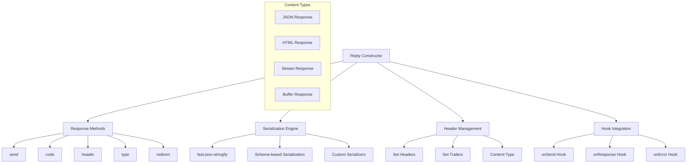
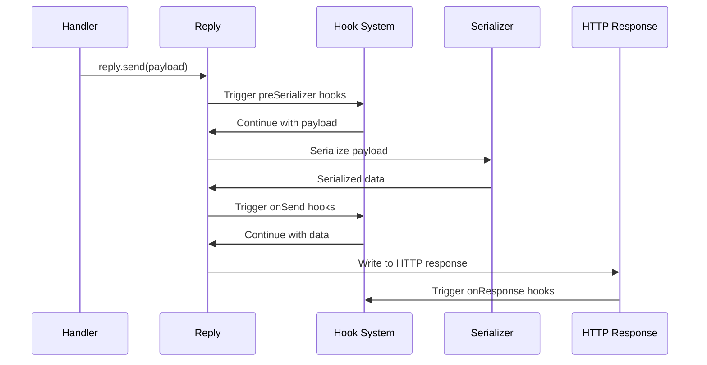

# Reply Module

Response handling and serialization with lifecycle hooks integration and performance optimization.

## Module Structure



## Public API

| Function/Property | Parameters | Returns | Description |
|-------------------|------------|---------|-------------|
| `Reply` | `res, request, log` | `Reply` | Constructor for reply object |
| `send` | `payload` | `Reply` | Send response with optional serialization |
| `code` | `statusCode` | `Reply` | Set HTTP status code |
| `status` | `statusCode` | `Reply` | Alias for code method |
| `header` | `name, value` | `Reply` | Set response header |
| `headers` | `object` | `Reply` | Set multiple headers |
| `type` | `contentType` | `Reply` | Set Content-Type header |
| `redirect` | `statusCode, url` | `Reply` | Send redirect response |
| `serializer` | `function` | `Reply` | Set custom serializer for this response |
| `hijack` | None | `Reply` | Take control of raw response object |

## Key Types

| Type | Properties | Description |
|------|------------|-------------|
| `ReplyObject` | `res, request, log, sent, statusCode` | Core reply object |
| `SerializerFunction` | `payload` → `string` | Custom payload serializer |
| `SendOptions` | `statusCode, headers, payload` | Response configuration |

## Usage Example

```javascript
// Basic response
reply.send({ hello: 'world' })

// Status code and headers
reply
  .code(201)
  .header('Location', '/users/123')
  .send({ id: 123, name: 'John' })

// Custom content type
reply
  .type('text/html')
  .send('<h1>Hello World</h1>')

// Stream response
const stream = fs.createReadStream('large-file.json')
reply.send(stream)

// Custom serializer
reply
  .serializer(JSON.stringify)
  .send(complexObject)

// Redirect
reply.redirect(302, '/login')
```

## Dependencies

| Dependency | Type | Purpose |
|------------|------|---------|
| `fast-json-stringify` | External | High-performance JSON serialization |
| `node:stream` | Built-in | Stream handling utilities |
| `./hooks` | Internal | Lifecycle hook runners |
| `./error-handler` | Internal | Error processing |
| `./schemas` | Internal | Schema-based serialization |

## Serialization Flow



## Content Type Handling

| Payload Type | Default Content-Type | Serializer |
|--------------|---------------------|------------|
| `Object/Array` | `application/json; charset=utf-8` | fast-json-stringify or JSON.stringify |
| `String` | `text/plain; charset=utf-8` | Pass-through |
| `Buffer` | `application/octet-stream` | Pass-through |
| `Stream` | `application/octet-stream` | Pipe to response |
| `undefined` | `application/json; charset=utf-8` | Empty response |

## Performance Optimizations

| Feature | Benefit | Implementation |
|---------|---------|----------------|
| **Schema Compilation** | 2-5x faster JSON serialization | Pre-compiled fast-json-stringify functions |
| **Header Caching** | Reduced string operations | Object-based header storage |
| **Status Code Validation** | Early error detection | Compile-time status code checking |
| **Stream Handling** | Memory efficiency | Direct pipe to response stream |
| **Hook Caching** | Reduced function calls | Pre-resolved hook arrays |