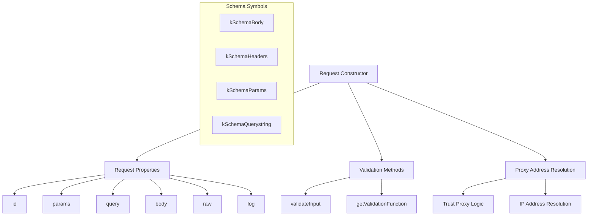
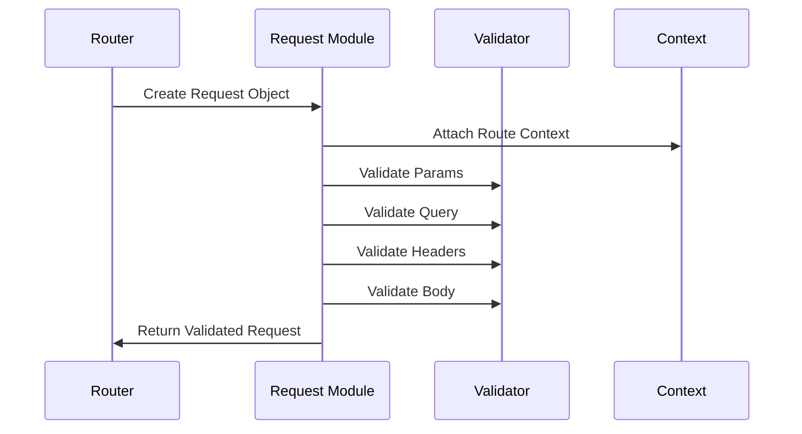

# Request Module

Request parsing and property management with proxy support and validation integration.

## Module Structure



## Public API

| Function/Property | Parameters | Returns | Description |
|-------------------|------------|---------|-------------|
| `Request` | `id, params, req, query, log, context` | `Request` | Constructor for request object |
| `validateInput` | `input, schema, httpPart` | `boolean` | Validates request input against schema |
| `getValidationFunction` | `httpPart` | `function` | Returns validation function for HTTP part |
| `compileValidationSchema` | `schema, httpPart` | `function` | Compiles validation schema |
| `ip` | None | `string` | Client IP address (proxy-aware) |
| `ips` | None | `Array<string>` | Array of client IP addresses |
| `hostname` | None | `string` | Request hostname |
| `protocol` | None | `string` | Request protocol (http/https) |

## Key Types

| Type | Properties | Description |
|------|------------|-------------|
| `RequestObject` | `id, params, raw, query, log, body` | Core request object |
| `ValidationOptions` | `httpPart, schema, method` | Validation configuration |
| `ProxyConfig` | `trustProxy, proxyAddr` | Proxy trust settings |

## Usage Example

```javascript
// Request object creation (internal)
const request = new Request(
  requestId,
  routeParams,
  rawRequest,
  queryParams,
  logger,
  routeContext
)

// Validate request body
const isValid = request.validateInput(
  request.body,
  context[kSchemaBody],
  'body'
)

// Access proxy-aware IP
console.log(request.ip) // Real client IP through proxy

// Access all IPs in chain
console.log(request.ips) // ['client-ip', 'proxy-ip']
```

## Dependencies

| Dependency | Type | Purpose |
|------------|------|---------|
| `@fastify/proxy-addr` | External | Proxy-aware IP address resolution |
| `./symbols` | Internal | Schema and internal state symbols |
| `./errors` | Internal | Request validation error types |
| `./decorate` | Internal | Request object decoration utilities |

## Configuration

| Option | Type | Default | Description |
|--------|------|---------|-------------|
| `trustProxy` | `boolean \| string \| number \| function` | `false` | Proxy trust configuration |
| `maxParamLength` | `number` | `100` | Maximum parameter value length |
| `caseSensitive` | `boolean` | `true` | Case sensitive parameter matching |

## Request Lifecycle



## Proxy Address Resolution

| Trust Setting | Behavior | Use Case |
|---------------|----------|----------|
| `false` | Use direct connection IP | No proxy |
| `true` | Trust all proxies | Internal network |
| `number` | Trust N hops | Known proxy count |
| `string` | Trust specific IP/CIDR | Specific proxy IPs |
| `function` | Custom trust logic | Complex proxy setup |