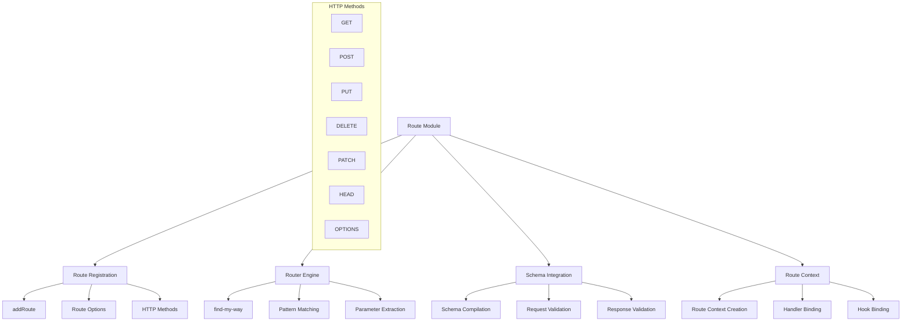
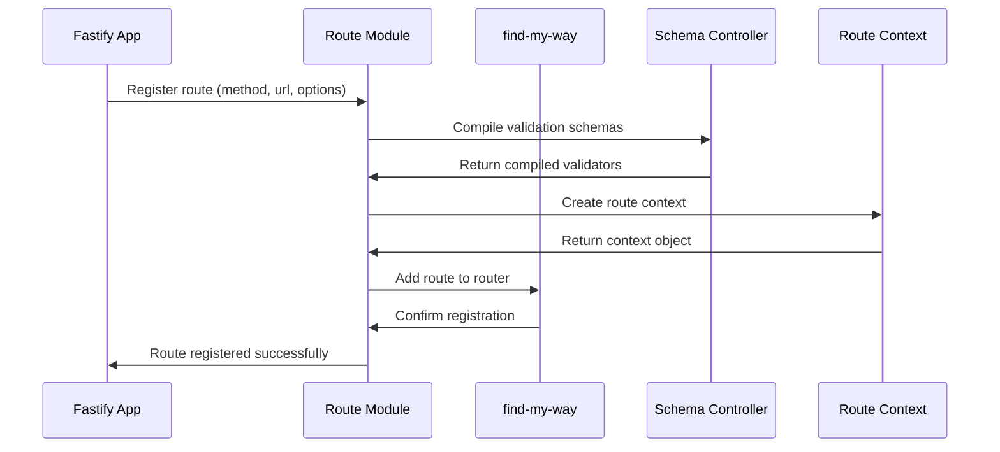
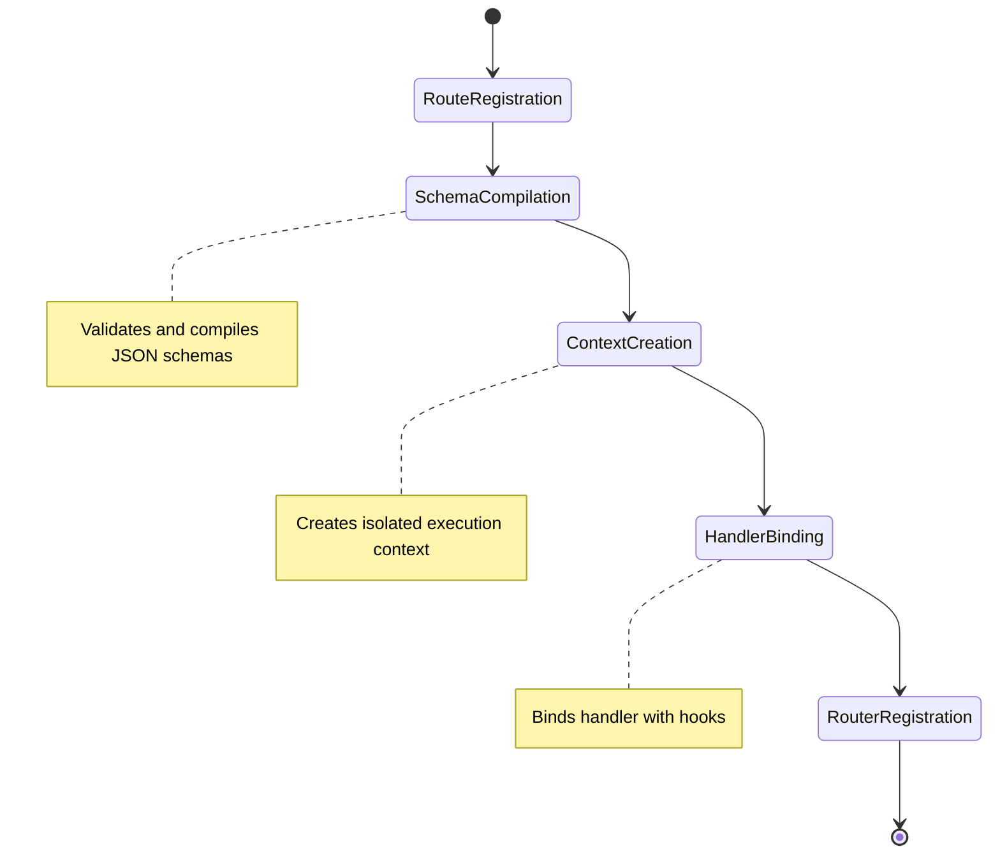

# Route Module

URL routing and route registration with high-performance pattern matching and validation integration.

## Module Structure



## Public API

| Function | Parameters | Returns | Description |
|----------|------------|---------|-------------|
| `buildRouting` | `options` | `Object` | Creates routing configuration |
| `validateBodyLimitOption` | `bodyLimit` | `number` | Validates and normalizes body limit |
| `buildRouterOptions` | `config` | `Object` | Builds find-my-way router options |
| `addRoute` | `routeOptions` | `void` | Registers new route |
| `buildRoute` | `context, handler` | `Function` | Builds route handler function |

## Key Types

| Type | Properties | Description |
|------|------------|-------------|
| `RouteOptions` | `method, url, handler, schema, config` | Complete route configuration |
| `RouteContext` | `schema, config, server, reply, request` | Route execution context |
| `RouteConfig` | `bodyLimit, timeout, logLevel` | Route-specific configuration |
| `RouteSchema` | `body, params, querystring, headers, response` | Request/response schemas |

## Usage Example

```javascript
// Simple route registration
fastify.get('/hello', async (request, reply) => {
  return { hello: 'world' }
})

// Route with validation schema
fastify.post('/users', {
  schema: {
    body: {
      type: 'object',
      properties: {
        name: { type: 'string' },
        email: { type: 'string', format: 'email' }
      },
      required: ['name', 'email']
    },
    response: {
      201: {
        type: 'object',
        properties: {
          id: { type: 'number' },
          name: { type: 'string' },
          email: { type: 'string' }
        }
      }
    }
  }
}, async (request, reply) => {
  const { name, email } = request.body
  const user = await createUser({ name, email })
  return reply.code(201).send(user)
})

// Route with parameters
fastify.get('/users/:id', async (request, reply) => {
  const { id } = request.params
  return getUserById(id)
})
```

## Dependencies

| Dependency | Type | Purpose |
|------------|------|---------|
| `find-my-way` | External | High-performance HTTP router |
| `./context` | Internal | Route execution context |
| `./handle-request` | Internal | Request handling pipeline |
| `./hooks` | Internal | Lifecycle hooks integration |
| `./validation` | Internal | Schema validation compilation |

## Configuration

| Option | Type | Default | Description |
|--------|------|---------|-------------|
| `caseSensitive` | `boolean` | `true` | Case sensitive route matching |
| `ignoreTrailingSlash` | `boolean` | `false` | Ignore trailing slash in URLs |
| `maxParamLength` | `number` | `100` | Maximum parameter length |
| `allowUnsafeRegex` | `boolean` | `false` | Allow potentially unsafe regex patterns |
| `bodyLimit` | `number` | `1048576` | Default request body size limit |

## Route Registration Flow



## URL Pattern Matching

| Pattern | Example | Matches | Parameters |
|---------|---------|---------|------------|
| Static | `/users` | `/users` | None |
| Named Parameter | `/users/:id` | `/users/123` | `{ id: '123' }` |
| Wildcard | `/files/*` | `/files/path/to/file.txt` | `{ '*': 'path/to/file.txt' }` |
| Optional Parameter | `/posts/:id?` | `/posts` or `/posts/123` | `{}` or `{ id: '123' }` |
| Regex Parameter | `/users/:id(\\d+)` | `/users/123` | `{ id: '123' }` |
| Multi-parameter | `/users/:id/posts/:postId` | `/users/1/posts/2` | `{ id: '1', postId: '2' }` |

## Route Context Lifecycle



## Performance Characteristics

| Feature | Benchmark | Implementation |
|---------|-----------|----------------|
| **Route Matching** | ~1M ops/sec | Radix tree with compressed paths |
| **Parameter Extraction** | ~500K ops/sec | Pre-compiled parameter parsers |
| **Schema Validation** | ~100K ops/sec | Pre-compiled AJV validators |
| **Memory Usage** | ~1KB per route | Optimized context objects |