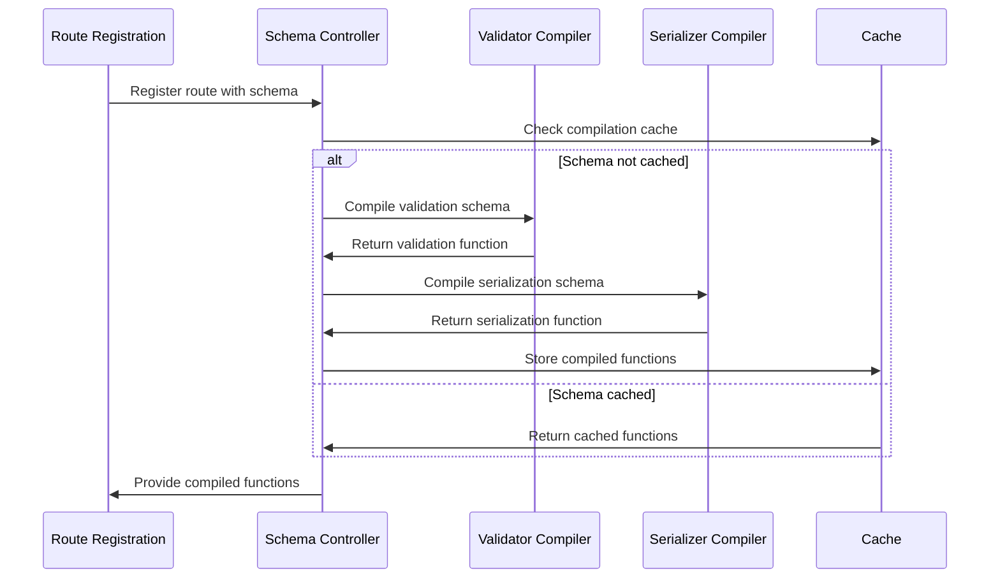
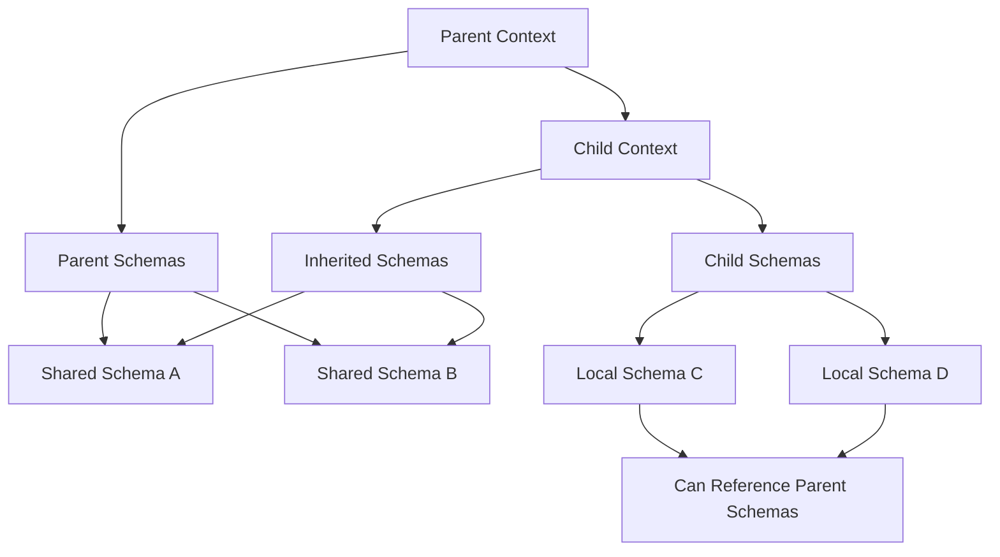

# Schema Controller Module

JSON schema compilation and management system providing high-performance validation and serialization.

## Module Structure

```mermaid
flowchart TD
    SchemaController[Schema Controller] --> Compilers[Compiler Factory]
    SchemaController --> Schemas[Schema Management]
    SchemaController --> Cache[Compilation Cache]
    
    Compilers --> ValidatorCompiler[Validator Compiler]
    Compilers --> SerializerCompiler[Serializer Compiler]
    
    ValidatorCompiler --> AJVCompiler[@fastify/ajv-compiler]
    SerializerCompiler --> FastJsonStringify[fast-json-stringify]
    
    Schemas --> AddSchema[Add Schema]
    Schemas --> GetSchema[Get Schema]
    Schemas --> CompileSchema[Compile Schema]
    
    Cache --> ValidationCache[Validation Cache]
    Cache --> SerializationCache[Serialization Cache]
    Cache --> SchemaStore[Schema Store]
    
    subgraph "Schema Types"
        RequestSchema[Request Schemas]
        ResponseSchema[Response Schemas]
        SharedSchema[Shared Schemas]
    end
```

## Public API

| Function | Parameters | Returns | Description |
|----------|------------|---------|-------------|
| `buildSchemaController` | `parentSchemaCtrl, opts` | `SchemaController` | Creates new schema controller instance |
| `addSchema` | `schema, schemaId` | `void` | Adds schema to the store |
| `getSchema` | `schemaId` | `Object` | Retrieves schema by ID |
| `getSchemas` | None | `Object` | Gets all registered schemas |
| `compileValidationSchema` | `schema, httpPart` | `Function` | Compiles validation function |
| `compileSerializationSchema` | `schema, statusCode` | `Function` | Compiles serialization function |

## Key Types

| Type | Properties | Description |
|------|------------|-------------|
| `SchemaController` | `compilersFactory, bucket, schemaBucket` | Main schema management object |
| `CompilersFactory` | `buildValidator, buildSerializer` | Compiler function providers |
| `SchemaOptions` | `$id, properties, required, type` | JSON Schema definition |
| `ValidationFunction` | `data` → `boolean` | Compiled validation function |
| `SerializationFunction` | `object` → `string` | Compiled serialization function |

## Usage Example

```javascript
// Create schema controller with custom options
const schemaController = buildSchemaController(null, {
  compilersFactory: {
    buildValidator: customAjvCompiler(),
    buildSerializer: customStringifyCompiler()
  }
})

// Add shared schema
schemaController.addSchema({
  $id: 'user',
  type: 'object',
  properties: {
    id: { type: 'number' },
    name: { type: 'string' },
    email: { type: 'string', format: 'email' }
  },
  required: ['id', 'name', 'email']
}, 'user')

// Reference shared schema in routes
const routeSchema = {
  body: { $ref: 'user#' },
  response: {
    200: { $ref: 'user#' }
  }
}

// Compile validation function
const validateBody = schemaController.compileValidationSchema(
  routeSchema.body,
  'body'
)

// Use compiled validator
const isValid = validateBody(requestBody)
```

## Dependencies

| Dependency | Type | Purpose |
|------------|------|---------|
| `@fastify/ajv-compiler` | External | JSON schema validation compiler |
| `@fastify/fast-json-stringify-compiler` | External | JSON serialization compiler |
| `./schemas` | Internal | Schema utility functions |

## Configuration

| Option | Type | Default | Description |
|--------|------|---------|-------------|
| `compilersFactory.buildValidator` | `function` | `AJVCompiler` | Validation compiler factory |
| `compilersFactory.buildSerializer` | `function` | `StringifyCompiler` | Serialization compiler factory |
| `ajv.customOptions` | `object` | `{}` | Custom AJV configuration |
| `ajv.plugins` | `Array` | `[]` | AJV plugins to load |

## Schema Compilation Flow



## Schema Inheritance



## Performance Optimizations

| Feature | Benefit | Implementation |
|---------|---------|----------------|
| **Compilation Caching** | Avoid recompilation | WeakMap-based cache by schema object |
| **Schema Deduplication** | Memory efficiency | Reference-based schema sharing |
| **Pre-compilation** | Runtime performance | Compile at registration time |
| **Context Isolation** | Plugin encapsulation | Separate schema namespaces |

## Schema Validation Lifecycle

| Phase | Action | Performance Impact |
|-------|--------|-------------------|
| **Registration** | Schema compilation | One-time cost |
| **Request** | Validation execution | ~10μs per validation |
| **Response** | Serialization execution | ~5μs per serialization |
| **Memory** | Function caching | ~1KB per compiled schema |

## Error Handling

| Error Type | Trigger | Resolution |
|------------|---------|------------|
| **Schema Compilation Error** | Invalid JSON Schema | Fix schema definition |
| **Validation Error** | Invalid request data | Return 400 Bad Request |
| **Serialization Error** | Invalid response data | Return 500 Internal Error |
| **Reference Error** | Missing schema reference | Add referenced schema |