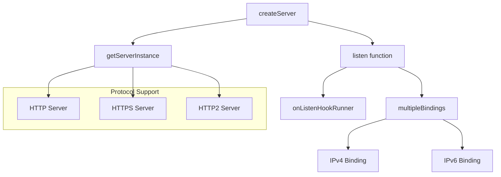
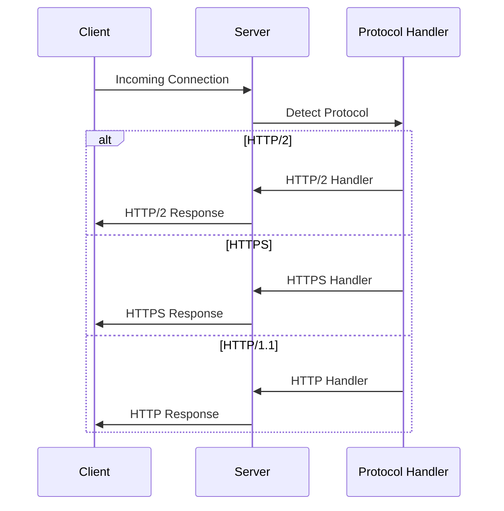

# Server Module

HTTP server creation and lifecycle management for multiple protocol support.

## Module Structure



## Public API

| Function | Parameters | Returns | Description |
|----------|------------|---------|-------------|
| `createServer` | `options, httpHandler` | `Object` | Creates server instance with listen method |
| `listen` | `listenOptions, callback` | `Promise` | Starts server listening on specified address |
| `close` | `callback` | `Promise` | Gracefully shuts down server and connections |
| `forceCloseConnections` | None | `void` | Forcibly closes all active connections |

## Key Types

| Type | Properties | Description |
|------|------------|-------------|
| `ListenOptions` | `port, host, path, backlog, exclusive` | Server listening configuration |
| `ServerOptions` | `http2, https, serverFactory` | Server creation options |
| `AddressInfo` | `address, port, family` | Server address information |

## Usage Example

```javascript
const { createServer } = require('./lib/server')

// Create HTTP server
const server = createServer(options, httpHandler)

// Listen on port 3000
const listen = server.listen.bind(fastifyInstance)
await listen({ port: 3000, host: '0.0.0.0' })

// Close server gracefully
await server.close()
```

## Dependencies

| Dependency | Type | Purpose |
|------------|------|---------|
| `node:http` | Built-in | HTTP/1.1 server creation |
| `node:https` | Built-in | HTTPS server creation |
| `node:http2` | Built-in | HTTP/2 server creation |
| `node:dns` | Built-in | DNS resolution for dual-stack |
| `find-my-way` | External | High-performance router |

## Configuration

| Option | Type | Default | Description |
|--------|------|---------|-------------|
| `serverFactory` | `function` | `undefined` | Custom server factory function |
| `http2` | `boolean \| object` | `false` | Enable HTTP/2 with optional settings |
| `https` | `object` | `undefined` | HTTPS options (key, cert, etc.) |
| `trustProxy` | `boolean \| string \| number` | `false` | Proxy trust configuration |
| `maxRequestsPerSocket` | `number` | `0` | Max requests per keep-alive socket |

## Protocol Detection Flow

