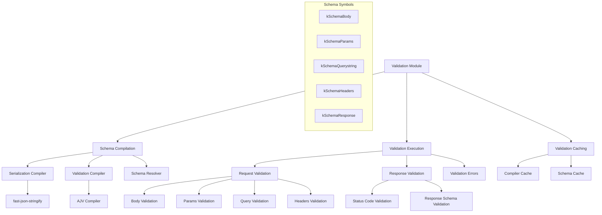
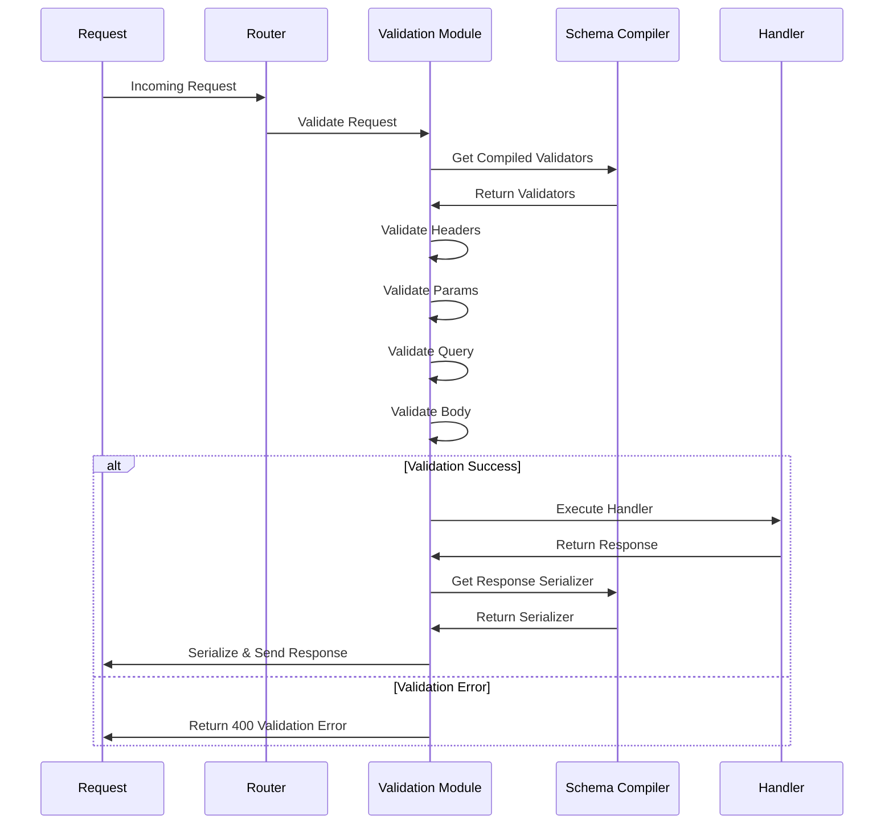
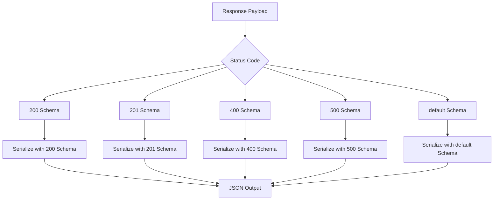

# Validation Module

JSON schema validation engine providing high-performance request and response validation with compilation caching.

## Module Structure



## Public API

| Function | Parameters | Returns | Description |
|----------|------------|---------|-------------|
| `compileSchemasForSerialization` | `context, compile` | `void` | Compiles response serialization schemas |
| `compileSchemasForValidation` | `context, compile` | `void` | Compiles request validation schemas |
| `validateParam` | `params, schema` | `boolean` | Validates route parameters |
| `validateBody` | `body, schema` | `boolean` | Validates request body |
| `validateQuery` | `query, schema` | `boolean` | Validates query parameters |
| `validateHeaders` | `headers, schema` | `boolean` | Validates request headers |

## Key Types

| Type | Properties | Description |
|------|------------|-------------|
| `ValidationContext` | `schema, config, server` | Route validation context |
| `CompiledValidator` | `validate` → `boolean` | Compiled validation function |
| `CompiledSerializer` | `serialize` → `string` | Compiled serialization function |
| `ValidationSchema` | `type, properties, required` | JSON Schema definition |

## Usage Example

```javascript
// Route schema definition
const userSchema = {
  body: {
    type: 'object',
    properties: {
      name: { type: 'string', minLength: 1 },
      email: { type: 'string', format: 'email' },
      age: { type: 'number', minimum: 0 }
    },
    required: ['name', 'email']
  },
  params: {
    type: 'object',
    properties: {
      id: { type: 'string', pattern: '^[0-9]+$' }
    },
    required: ['id']
  },
  querystring: {
    type: 'object',
    properties: {
      format: { type: 'string', enum: ['json', 'xml'] },
      limit: { type: 'number', minimum: 1, maximum: 100 }
    }
  },
  headers: {
    type: 'object',
    properties: {
      'authorization': { type: 'string' }
    },
    required: ['authorization']
  },
  response: {
    200: {
      type: 'object',
      properties: {
        id: { type: 'number' },
        name: { type: 'string' },
        email: { type: 'string' }
      }
    },
    400: {
      type: 'object',
      properties: {
        error: { type: 'string' }
      }
    }
  }
}

// Schema compilation happens automatically during route registration
fastify.post('/users/:id', { schema: userSchema }, async (request, reply) => {
  // All inputs are pre-validated
  const { id } = request.params
  const { name, email, age } = request.body
  const { format, limit } = request.query
  
  // Process validated data
  const user = await updateUser(id, { name, email, age })
  return user // Response is automatically serialized
})
```

## Dependencies

| Dependency | Type | Purpose |
|------------|------|---------|
| `@fastify/ajv-compiler` | External | JSON Schema validation compilation |
| `fast-json-stringify` | External | High-performance JSON serialization |
| `./symbols` | Internal | Schema storage symbols |
| `./errors` | Internal | Validation error types |

## Validation Flow



## Schema Compilation

| HTTP Part | Symbol | Validation Target | Error Code |
|-----------|--------|------------------|------------|
| **Body** | `kSchemaBody` | `request.body` | 400 |
| **Parameters** | `kSchemaParams` | `request.params` | 400 |
| **Query** | `kSchemaQuerystring` | `request.query` | 400 |
| **Headers** | `kSchemaHeaders` | `request.headers` | 400 |
| **Response** | `kSchemaResponse` | `reply.send()` payload | 500 |

## Response Schema Validation



## Validation Error Format

```json
{
  "statusCode": 400,
  "error": "Bad Request",
  "message": "body.email should match format \"email\"",
  "validation": [
    {
      "keyword": "format",
      "dataPath": ".email",
      "schemaPath": "#/properties/email/format",
      "params": {
        "format": "email"
      },
      "message": "should match format \"email\""
    }
  ]
}
```

## Performance Characteristics

| Operation | Performance | Implementation |
|-----------|-------------|----------------|
| **Schema Compilation** | ~10ms per schema | One-time cost during route registration |
| **Request Validation** | ~10μs per request | Pre-compiled AJV validators |
| **Response Serialization** | ~5μs per response | Pre-compiled fast-json-stringify |
| **Memory Overhead** | ~1KB per schema | Compiled function storage |

## Configuration Options

| Option | Type | Default | Description |
|--------|------|---------|-------------|
| `removeAdditional` | `boolean` | `true` | Remove additional properties |
| `useDefaults` | `boolean` | `true` | Fill in default values |
| `coerceTypes` | `boolean` | `true` | Type coercion for params/query |
| `allErrors` | `boolean` | `false` | Return all validation errors |
| `nullable` | `boolean` | `false` | Allow null values |