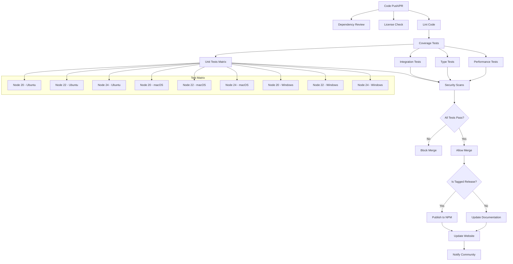
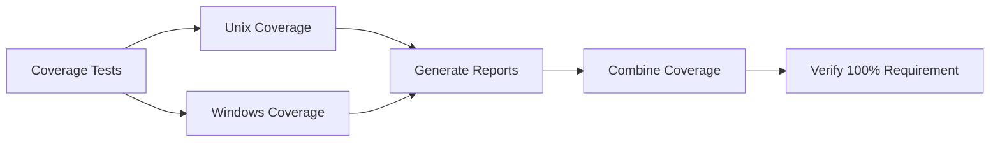
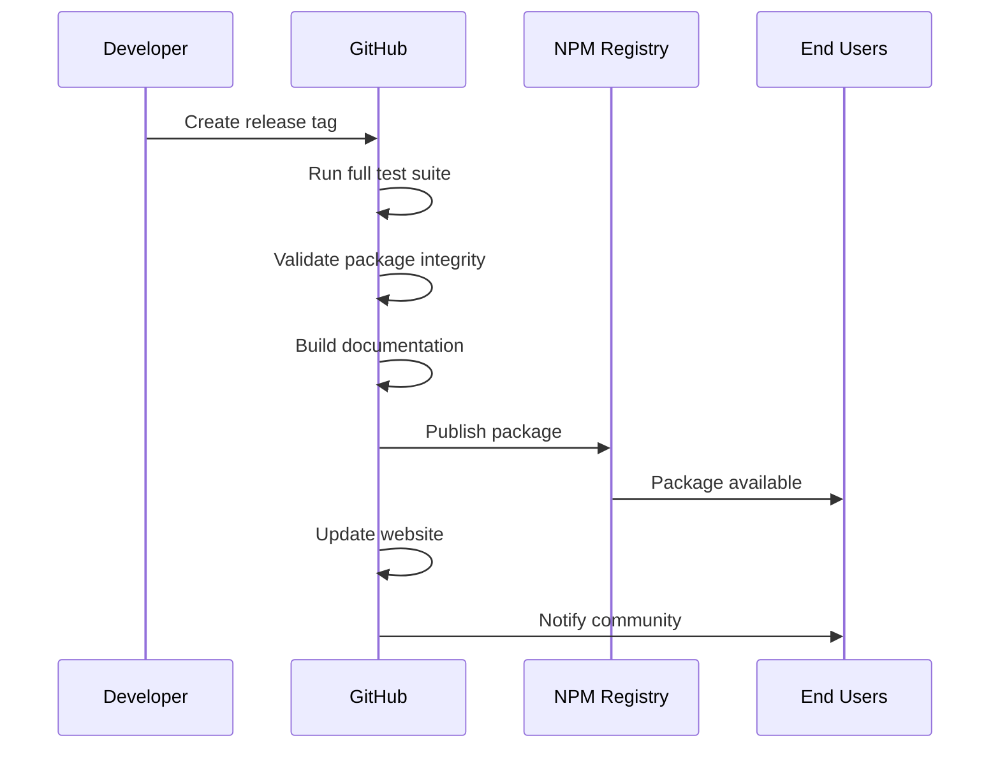

# CI/CD Pipeline

This document describes the continuous integration and deployment pipeline for the Fastify web framework.

## Pipeline Overview

The CI/CD pipeline ensures code quality, compatibility, and reliability through automated testing and validation across multiple environments.

## Trigger Conditions

| Event | Workflows Triggered | Purpose |
|-------|-------------------|---------|
| **Push to main** | Full CI pipeline | Validate production-ready code |
| **Push to next** | Full CI pipeline | Test upcoming features |
| **Push to *.x** | Full CI pipeline | Validate maintenance releases |
| **Pull Request** | Full CI pipeline | Review and validate changes |
| **Manual Dispatch** | Custom Node.js version testing | Test against specific Node versions |
| **Scheduled** | Security scans, performance benchmarks | Regular maintenance |
| **Release Tag** | Publication pipeline | Deploy to NPM registry |

## Pipeline Stages

### 1. Code Quality Gates

**Dependency Review** (Pull requests only)
- Scans new dependencies for security vulnerabilities
- Reviews license compatibility
- Blocks PRs with vulnerable dependencies

**License Verification**
- Validates all production dependencies use approved licenses
- Allowed: 0BSD, Apache-2.0, BSD-2-Clause, BSD-3-Clause, ISC, MIT
- Fails if unlicensed or non-approved licenses found

**Code Linting**
- Runs ESLint with project-specific rules
- Enforces coding standards and best practices
- Must pass before other tests execute

### 2. Testing Matrix

**Coverage Testing**

**Unit Testing Matrix**
- **Node.js Versions**: 20, 22, 24 (LTS and current)
- **Operating Systems**: Ubuntu, macOS, Windows
- **Total Combinations**: 9 test environments
- **Execution**: Parallel across all combinations
- **Failure Policy**: Any failure blocks the pipeline

**TypeScript Validation**
- Compiles TypeScript definitions
- Validates type compatibility
- Runs type-specific tests with tsd

**Integration Testing**
- Tests with alternative Node.js runtimes
- Validates plugin ecosystem compatibility
- Cross-version compatibility testing

### 3. Performance Validation

**Benchmark Testing**
- HTTP request throughput testing with AutoCannon
- Parser performance validation
- Regression detection against baseline
- Performance metrics reporting

**Load Testing Scripts**
| Script | Purpose | Metrics |
|--------|---------|---------|
| `npm run benchmark` | Basic HTTP performance | Requests/sec, latency |
| `npm run benchmark:parser` | JSON parsing speed | Parser throughput |
| `npm run benchmark:parser:error` | Error handling performance | Error path latency |

### 4. Security Scanning

**Vulnerability Assessment**
- NPM audit for known vulnerabilities
- Dependency chain security analysis
- License compliance validation
- Security advisory integration

**Code Security**
- Static analysis for security patterns
- Injection vulnerability detection
- Secrets scanning (keys, tokens)

### 5. Publication Pipeline

**Pre-publication Validation**

**Publication Steps**
1. **Integrity Check**: Validates built files match source
2. **Version Sync**: Updates version across all files  
3. **Package Build**: Creates distribution package
4. **NPM Publication**: Publishes to public registry
5. **Documentation Update**: Refreshes docs and website
6. **Community Notification**: Updates changelog and announcements

## Environment Variables

The CI/CD pipeline uses several environment variables for configuration:

| Variable | Usage | Scope |
|----------|--------|-------|
| `PREPUBLISH` | Publication validation flag | Pre-publication |
| `GITHUB_TOKEN` | Repository access | All workflows |
| `NPM_TOKEN` | Registry publishing | Publication only |
| `NODE_VERSION` | Custom Node.js version testing | Manual dispatch |

**Note**: All secrets are managed through GitHub Secrets and never exposed in logs.

## Quality Metrics

### Test Coverage Requirements
- **Minimum Coverage**: 100% line coverage required
- **Coverage Tools**: c8 (V8 JavaScript coverage)
- **Coverage Verification**: Automated check blocks failing builds
- **Coverage Reporting**: HTML reports generated for analysis

### Performance Thresholds
- **Request Latency**: p99 < 1ms for simple routes
- **Throughput**: > 100k requests/sec baseline
- **Memory Usage**: < 50MB framework overhead
- **Startup Time**: < 100ms for basic server

### Security Standards
- **Dependency Scanning**: Daily vulnerability checks
- **License Compliance**: Only approved open-source licenses
- **Security Patches**: Released within 48 hours of disclosure
- **CVE Response**: Coordinated disclosure process

## Failure Handling

### Build Failures
- **Immediate Notification**: Maintainers notified within 5 minutes
- **Failure Analysis**: Automated logs and test reports
- **Quick Recovery**: Rollback procedures for critical issues
- **Post-Mortem**: Analysis for repeated failures

### Recovery Procedures
- **Test Flakiness**: Re-run failing tests up to 3 times
- **Infrastructure Issues**: Automatic retry with different runners  
- **Dependency Failures**: Fallback to cached dependencies
- **Publication Failures**: Manual intervention with maintainer approval

## Monitoring and Alerting

### Pipeline Health
- **Success Rate**: Track percentage of successful builds
- **Duration Monitoring**: Alert on pipeline duration increases
- **Flaky Test Detection**: Identify and fix unstable tests
- **Resource Usage**: Monitor GitHub Actions minutes consumption

### Release Monitoring
- **Download Metrics**: Track NPM package downloads
- **Version Adoption**: Monitor version distribution in the wild
- **Issue Correlation**: Link releases to issue reports
- **Performance Impact**: Monitor real-world performance metrics