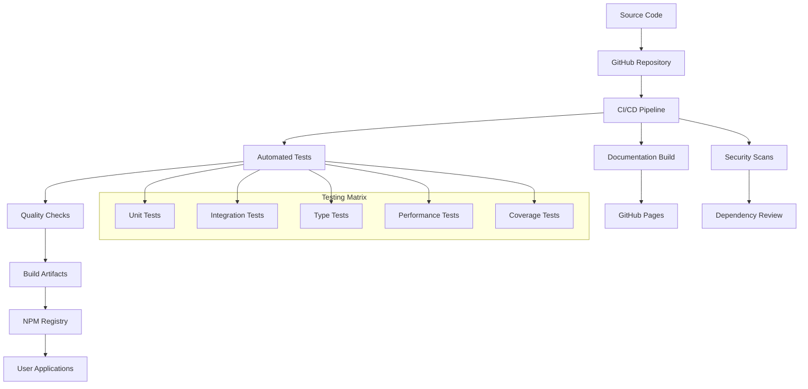

# DevOps Overview

This document describes the development operations and deployment model for the Fastify web framework project.

## Development Model

Fastify follows an open-source, community-driven development model with automated testing and continuous integration.

### Repository Structure
- **Main Branch**: `main` - stable, production-ready code
- **Development Branches**: `next` - upcoming features and breaking changes
- **Release Branches**: `*.x` - maintenance branches for major versions
- **Feature Branches**: Short-lived branches for specific features or fixes

### Release Strategy
- **Semantic Versioning**: Follows SemVer (MAJOR.MINOR.PATCH)
- **Regular Releases**: Monthly minor releases with new features
- **Security Patches**: Immediate patch releases for security issues
- **LTS Support**: Long-term support for specific major versions

## Deployment Model

Fastify is distributed as an npm package and deployed to various environments by end users.

## Environments

| Environment | Purpose | Deployment Trigger | Access |
|-------------|---------|-------------------|---------|
| **Development** | Local developer workstations | Manual | Developers |
| **CI Testing** | Automated test execution | Every commit/PR | GitHub Actions |
| **Documentation** | Generated docs hosting | Merged to main | Public (GitHub Pages) |
| **NPM Registry** | Package distribution | Tagged releases | Public |
| **Performance Testing** | Benchmark validation | Scheduled/manual | Maintainers |

## Quality Gates

### Automated Checks
- **Code Quality**: ESLint for style and best practices
- **Type Safety**: TypeScript definitions validation
- **Security**: Dependency vulnerability scanning
- **Performance**: Regression testing against benchmarks
- **Coverage**: Minimum 90% test coverage requirement

### Manual Review Process
- **Pull Request Review**: Required by maintainers
- **Architecture Review**: For significant changes
- **Breaking Change Review**: Community discussion for major versions
- **Security Review**: For security-related changes

## Monitoring and Observability

### Package Health
- **Download Metrics**: NPM download statistics tracking
- **Version Adoption**: Monitoring version distribution
- **Issue Tracking**: GitHub issue metrics and response times
- **Performance Benchmarks**: Regular performance regression testing

### Dependency Management
- **Security Alerts**: Automated vulnerability scanning
- **License Compliance**: Open source license validation
- **Update Monitoring**: Tracking upstream dependency updates
- **Compatibility Testing**: Cross-version compatibility validation

## Infrastructure

### Hosting and Distribution
- **Source Code**: GitHub (primary repository)
- **Package Distribution**: NPM Registry
- **Documentation**: GitHub Pages
- **CI/CD**: GitHub Actions
- **Issue Tracking**: GitHub Issues
- **Community**: GitHub Discussions, Discord

### Development Tools
- **Version Control**: Git with GitHub
- **Package Manager**: NPM
- **Testing Framework**: Tap (Test Anything Protocol)
- **Benchmarking**: AutoCannon for performance testing
- **Code Coverage**: c8 (V8 JavaScript coverage)

## Support and Maintenance

### Support Tiers
- **Community Support**: GitHub Issues and Discussions
- **Commercial Support**: Available through partners
- **Security Issues**: Private disclosure via security@fastify.io
- **LTS Support**: Extended support for major versions

### Maintenance Windows
- **Regular Updates**: Monthly feature releases
- **Security Patches**: Released within 48 hours of disclosure
- **Dependency Updates**: Quarterly major dependency updates
- **Performance Optimization**: Ongoing with benchmark validation

### End-of-Life Policy
- **Support Duration**: 18 months for major versions
- **Migration Path**: Clear upgrade guides and compatibility layers
- **Community Notification**: 6-month advance notice for EOL
- **Critical Security**: Backported for 6 months post-EOL