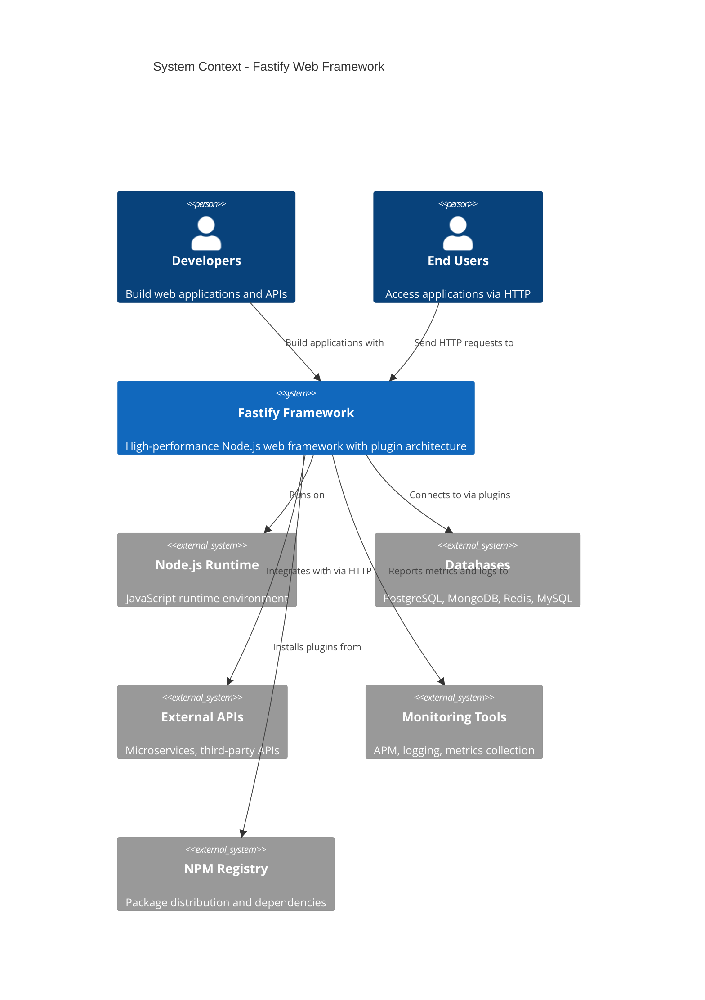
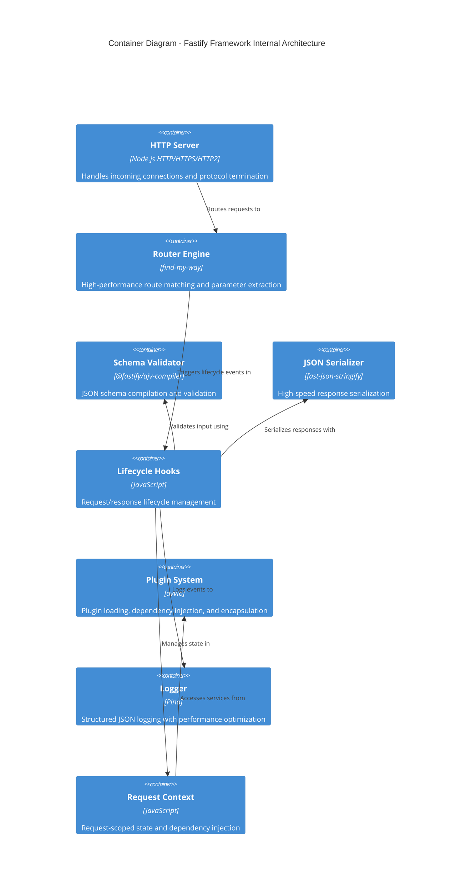
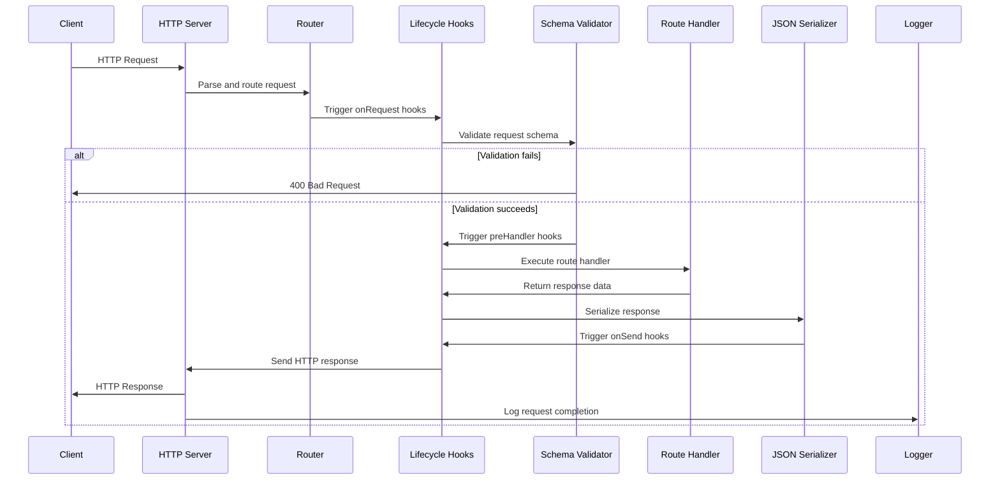

# Architecture

This document describes the system architecture and design principles of the Fastify web framework.

## System Context

Fastify operates within the Node.js ecosystem as a high-performance web framework that connects developers, applications, and external systems.

## Container Architecture

Fastify's internal architecture consists of several key containers that work together to provide high-performance request processing.

## Core Component Interactions

This sequence diagram shows how the main components interact during a typical HTTP request lifecycle.

## Technology Stack

| Component | Technology | Purpose |
|-----------|------------|---------|
| **Runtime** | Node.js 18+ | JavaScript execution environment |
| **HTTP Server** | Node.js http/https/http2 | Protocol handling and connection management |
| **Router** | find-my-way | High-performance URL routing and parameter extraction |
| **Schema Validation** | @fastify/ajv-compiler | JSON Schema compilation and request validation |
| **JSON Serialization** | fast-json-stringify | High-speed response serialization |
| **Plugin System** | avvio | Dependency injection and plugin lifecycle management |
| **Logging** | Pino | Structured JSON logging with minimal overhead |
| **Testing** | light-my-request | HTTP injection for unit testing |

## Key Design Patterns

### Plugin Architecture
- **Encapsulation**: Each plugin operates in its own context with isolated scope
- **Dependency Injection**: Plugins can declare and inject dependencies
- **Lifecycle Management**: Automatic plugin loading and initialization ordering

### Hook System
- **Observer Pattern**: Lifecycle events allow non-invasive request processing
- **Chain of Responsibility**: Hooks execute in defined order with ability to halt processing
- **Decorator Pattern**: Request and reply objects can be enhanced by plugins

### Schema-Driven Development
- **Contract-First**: Define JSON schemas for validation and serialization
- **Performance**: Pre-compiled validators and serializers for speed
- **Type Safety**: Schema definitions provide runtime type checking

## Key Design Decisions

### Performance-First Architecture
**Decision**: Prioritize speed and low overhead in every architectural choice.

**Rationale**: Web framework performance directly impacts application scalability and user experience. Fastify is designed for high-throughput scenarios.

**Implementation**: 
- Pre-compiled route matching with radix trees
- Schema pre-compilation for validation and serialization
- Minimal object creation in hot paths
- Optimized logging with async writing

### Plugin-Based Extensibility
**Decision**: Use a formal plugin system instead of middleware-only approach.

**Rationale**: Provides better encapsulation, dependency management, and testing compared to traditional middleware chains.

**Implementation**:
- Avvio-based plugin system with dependency resolution
- Context isolation between plugins
- Declarative plugin dependencies and loading order

### Schema-Centric Validation
**Decision**: Make JSON Schema validation a first-class feature.

**Rationale**: Type safety and performance benefits from pre-compiled validation, plus automatic documentation generation.

**Implementation**:
- AJV-based schema compilation
- Schema-driven serializer generation
- Integration with TypeScript definitions

### HTTP Protocol Agnostic
**Decision**: Support multiple HTTP protocol versions transparently.

**Rationale**: Future-proof the framework as HTTP/2 and HTTP/3 adoption increases.

**Implementation**:
- Abstract server creation supporting HTTP/1.1, HTTP/2, and HTTPS
- Protocol-agnostic request/response interfaces
- Automatic protocol detection and optimization

## Performance Characteristics

| Metric | Typical Value | Notes |
|--------|---------------|-------|
| **Requests/sec** | 100,000+ | On modern hardware with simple routes |
| **Latency (p99)** | < 1ms | For in-memory operations |
| **Memory Usage** | ~50MB base | Framework overhead, excluding application code |
| **Plugin Load Time** | < 100ms | For typical plugin with dependencies |
| **Schema Compilation** | < 10ms | Per schema during application startup |

## Scalability Considerations

### Horizontal Scaling
- **Stateless Design**: No server-side session state in core framework
- **Cluster Mode**: Supports Node.js cluster module for multi-process deployment
- **Load Balancer Ready**: Designed for deployment behind reverse proxies

### Vertical Scaling
- **Non-blocking I/O**: Leverages Node.js event loop for high concurrency
- **Memory Efficiency**: Minimal object allocation in request processing
- **CPU Optimization**: Pre-compiled components reduce runtime computation