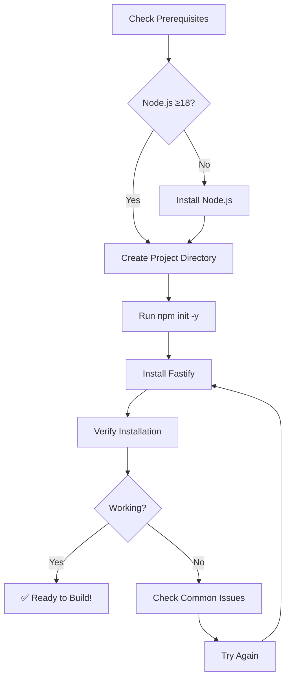

# Installation

Get Fastify running on your machine in under 5 minutes.

## Prerequisites

| Tool | Version | Why needed |
|------|---------|-------------|
| Node.js | ≥18.x | JavaScript runtime for executing Fastify |
| npm | ≥8.x | Package manager (comes with Node.js) |
| Text Editor | Any | For writing code (VS Code, WebStorm, etc.) |

## Installation Steps

### 1. Check Node.js Installation

```bash
node --version
npm --version
```

**You know it worked when you see**: Version numbers like `v18.x.x` or higher for Node.js and `8.x.x` or higher for npm.

### 2. Create Your Project

```bash
# Create a new directory
mkdir my-fastify-project
cd my-fastify-project

# Initialize package.json
npm init -y
```

**You know it worked when you see**: A `package.json` file created in your directory.

### 3. Install Fastify

```bash
# Install Fastify as a dependency
npm install fastify

# Optionally install TypeScript support
npm install --save-dev typescript @types/node
```

**You know it worked when you see**: 
- `node_modules/` directory created
- `package-lock.json` file created
- Fastify listed in your `package.json` dependencies

### 4. Verify Installation

Create a simple test file `test.js`:

```javascript
const fastify = require('fastify')({ logger: true })

console.log('Fastify loaded successfully!')
console.log('Version:', fastify.version)
```

Run the test:

```bash
node test.js
```

**You know it worked when you see**: 
```
Fastify loaded successfully!
Version: 4.x.x
```

## Installation Flow



## Common Installation Issues

| Problem | Solution |
|---------|----------|
| `npm install` fails with permission errors | Use `npm config set prefix ~/.npm` or install Node.js via Node Version Manager (nvm) |
| `node: command not found` | Node.js not in PATH - reinstall Node.js or add to PATH manually |
| Version conflicts | Use `npm ls` to check versions, `npm update` to update packages |
| Module not found errors | Delete `node_modules` and run `npm install` again |
| TypeScript errors | Install `@types/node`: `npm install --save-dev @types/node` |

## Next Steps

Now that Fastify is installed, head over to the [Quickstart Guide](quickstart.md) to build your first API in under 5 minutes.

## Alternative Installation Methods

### Using Yarn

```bash
# If you prefer Yarn package manager
yarn add fastify
```

### Using pnpm

```bash
# If you prefer pnpm package manager
pnpm add fastify
```

### Global Installation (Not Recommended)

While you can install Fastify globally, it's recommended to install it as a project dependency for better version control and team collaboration.

---

*Need help? Check out [Troubleshooting](../guides/troubleshooting.md) or visit our [community discussions](https://github.com/fastify/fastify/discussions).*