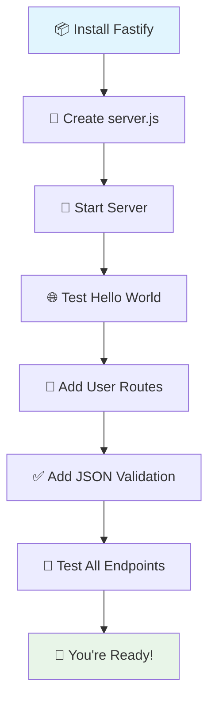

# Quickstart Guide

Build your first Fastify API in under 5 minutes. This guide assumes you have already [installed Fastify](installation.md).

## What You'll Build

A simple REST API that manages a list of users. By the end, you'll have:
- A working HTTP server
- GET endpoint to fetch users
- POST endpoint to create users  
- JSON schema validation
- Built-in logging

## Your First Server

### Step 1: Create the Server File

Create `server.js` in your project directory:

```javascript
const fastify = require('fastify')({ 
  logger: true 
})

// Your first route
fastify.get('/', async (request, reply) => {
  return { message: 'Hello World!' }
})

// Start the server
const start = async () => {
  try {
    await fastify.listen({ port: 3000, host: '0.0.0.0' })
    console.log('🚀 Server running at http://localhost:3000')
  } catch (err) {
    fastify.log.error(err)
    process.exit(1)
  }
}

start()
```

### Step 2: Start Your Server

```bash
node server.js
```

**You know it worked when you see**: 
```
🚀 Server running at http://localhost:3000
```

### Step 3: Test Your API

Open a new terminal and test:

```bash
curl http://localhost:3000
```

**You know it worked when you see**: 
```json
{"message":"Hello World!"}
```

## Add User Management

Now let's build a real API with data validation.

### Step 4: Add User Routes

Replace your `server.js` with this enhanced version:

```javascript
const fastify = require('fastify')({ logger: true })

// In-memory data store (for demo only)
let users = [
  { id: 1, name: 'Alice', email: 'alice@example.com' },
  { id: 2, name: 'Bob', email: 'bob@example.com' }
]
let nextId = 3

// Schema for user validation
const userSchema = {
  type: 'object',
  required: ['name', 'email'],
  properties: {
    name: { type: 'string', minLength: 1 },
    email: { type: 'string', format: 'email' }
  }
}

// Get all users
fastify.get('/users', async (request, reply) => {
  return { users }
})

// Get user by ID
fastify.get('/users/:id', async (request, reply) => {
  const { id } = request.params
  const user = users.find(u => u.id === parseInt(id))
  
  if (!user) {
    reply.status(404)
    return { error: 'User not found' }
  }
  
  return { user }
})

// Create new user
fastify.post('/users', {
  schema: {
    body: userSchema,
    response: {
      201: {
        type: 'object',
        properties: {
          user: {
            type: 'object',
            properties: {
              id: { type: 'number' },
              name: { type: 'string' },
              email: { type: 'string' }
            }
          }
        }
      }
    }
  }
}, async (request, reply) => {
  const { name, email } = request.body
  
  // Check if email already exists
  const exists = users.find(u => u.email === email)
  if (exists) {
    reply.status(400)
    return { error: 'Email already exists' }
  }
  
  const user = { id: nextId++, name, email }
  users.push(user)
  
  reply.status(201)
  return { user }
})

// Health check
fastify.get('/health', async (request, reply) => {
  return { status: 'OK', timestamp: new Date().toISOString() }
})

// Start server
const start = async () => {
  try {
    await fastify.listen({ port: 3000, host: '0.0.0.0' })
    console.log('🚀 Server running at http://localhost:3000')
    console.log('📖 Available endpoints:')
    console.log('  GET  /users      - List all users')
    console.log('  GET  /users/:id  - Get user by ID')
    console.log('  POST /users      - Create new user')
    console.log('  GET  /health     - Health check')
  } catch (err) {
    fastify.log.error(err)
    process.exit(1)
  }
}

start()
```

### Step 5: Test Your Complete API

Restart your server and test each endpoint:

```bash
# Restart server
node server.js
```

**Test GET /users:**
```bash
curl http://localhost:3000/users
```

**Test POST /users (create new user):**
```bash
curl -X POST http://localhost:3000/users \
  -H "Content-Type: application/json" \
  -d '{"name":"Charlie","email":"charlie@example.com"}'
```

**Test GET /users/:id:**
```bash
curl http://localhost:3000/users/1
```

**Test validation (invalid email):**
```bash
curl -X POST http://localhost:3000/users \
  -H "Content-Type: application/json" \
  -d '{"name":"Invalid","email":"not-an-email"}'
```

## Quickstart Journey



## What You Just Built

Congratulations! You've created a production-ready API foundation with:

- ✅ **HTTP Server**: Listening on port 3000
- ✅ **REST Endpoints**: GET and POST operations
- ✅ **JSON Validation**: Automatic request validation
- ✅ **Error Handling**: Proper HTTP status codes
- ✅ **Logging**: Built-in request/response logging
- ✅ **Type Safety**: JSON schema validation

## Common Test Results

**✅ Successful user creation:**
```json
{
  "user": {
    "id": 3,
    "name": "Charlie",
    "email": "charlie@example.com"
  }
}
```

**❌ Validation error:**
```json
{
  "statusCode": 400,
  "error": "Bad Request",
  "message": "body/email must match format \"email\""
}
```

## Next Steps

Now that you have a working API, explore these topics:

1. **[Configuration](../guides/configuration.md)** - Customize your Fastify server
2. **[Architecture](../explanation/architecture.md)** - Understand Fastify's design
3. **[Plugin System](../guides/plugins.md)** - Extend functionality
4. **[Testing](../guides/testing.md)** - Write tests for your API

## Quick Development Tips

- **Auto-restart**: Use `npm install -g nodemon` then `nodemon server.js` for automatic restarts
- **Debug mode**: Add `DEBUG=fastify:* node server.js` for detailed debugging
- **Environment**: Use different ports with `PORT=4000 node server.js`

---

*Having trouble? Check [Troubleshooting](../guides/troubleshooting.md) or ask the [community](https://github.com/fastify/fastify/discussions).*