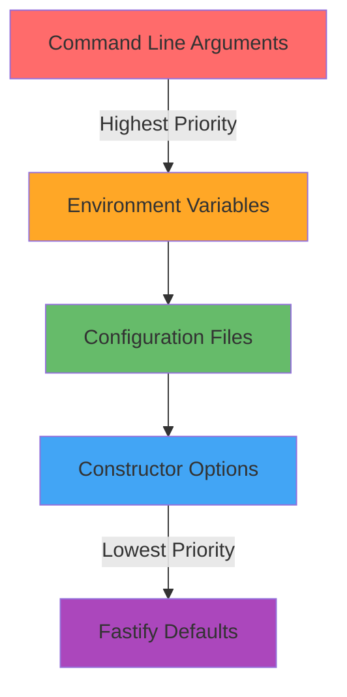

# Configuration Guide

Configure your Fastify server for different environments and use cases. This guide covers all configuration options and common scenarios.

## Configuration Basics

Fastify accepts configuration options when creating the server instance:

```javascript
const fastify = require('fastify')({
  // Configuration options go here
  logger: true,
  bodyLimit: 1048576,
  caseSensitive: true
})
```

## Configuration File Locations

| Method | Location | Format | Use Case |
|--------|----------|--------|----------|
| Constructor | Code | JavaScript object | Basic configuration |
| Environment Variables | `.env` file | KEY=value | Environment-specific settings |
| Config Files | `config/` directory | JSON/JS modules | Complex configurations |
| Command Line | CLI args | `--option=value` | Override settings |

## Environment Variables

| Name | Description | Default | Required |
|------|-------------|---------|----------|
| `PORT` | Server listening port | `3000` | No |
| `HOST` | Server host address | `localhost` | No |
| `NODE_ENV` | Environment mode | `development` | No |
| `LOG_LEVEL` | Logging level (trace, debug, info, warn, error, fatal) | `info` | No |
| `TRUST_PROXY` | Trust proxy headers | `false` | No |
| `BODY_LIMIT` | Maximum request body size in bytes | `1048576` | No |

### Example .env file:

```env
PORT=4000
HOST=0.0.0.0
NODE_ENV=production
LOG_LEVEL=warn
TRUST_PROXY=true
BODY_LIMIT=2097152
```

## Configuration Precedence



## Common Configuration Scenarios

### 1. Development Setup

```javascript
const isDev = process.env.NODE_ENV !== 'production'

const fastify = require('fastify')({
  logger: isDev ? {
    transport: {
      target: 'pino-pretty',
      options: {
        colorize: true
      }
    }
  } : true,
  disableRequestLogging: !isDev,
  ignoreTrailingSlash: true,
  caseSensitive: false
})

// Enable CORS in development
if (isDev) {
  await fastify.register(require('@fastify/cors'), {
    origin: true
  })
}
```

### 2. Production Setup

```javascript
const fastify = require('fastify')({
  logger: {
    level: process.env.LOG_LEVEL || 'warn',
    serializers: {
      req: require('pino-std-serializers').req,
      res: require('pino-std-serializers').res
    }
  },
  trustProxy: true,
  bodyLimit: parseInt(process.env.BODY_LIMIT) || 1048576,
  keepAliveTimeout: 30000,
  connectionTimeout: 10000
})

// Security headers
await fastify.register(require('@fastify/helmet'))

// Rate limiting
await fastify.register(require('@fastify/rate-limit'), {
  max: 100,
  timeWindow: '1 minute'
})
```

### 3. Testing Setup

```javascript
const fastify = require('fastify')({
  logger: false, // Disable logging in tests
  pluginTimeout: 0 // Disable plugin timeout
})

// Inject test utilities
fastify.addHook('onReady', async () => {
  // Setup test database, mocks, etc.
})
```

## Configuration with Files

### config/default.js
```javascript
module.exports = {
  server: {
    port: process.env.PORT || 3000,
    host: process.env.HOST || '0.0.0.0'
  },
  logger: {
    level: process.env.LOG_LEVEL || 'info'
  },
  database: {
    url: process.env.DATABASE_URL || 'postgres://localhost:5432/myapp'
  }
}
```

### config/production.js
```javascript
module.exports = {
  logger: {
    level: 'warn'
  },
  server: {
    trustProxy: true
  }
}
```

### Loading configuration:
```javascript
const config = require('config')

const fastify = require('fastify')({
  logger: config.get('logger'),
  trustProxy: config.get('server.trustProxy')
})

await fastify.listen({
  port: config.get('server.port'),
  host: config.get('server.host')
})
```

## Performance Configuration

### High-Throughput Setup

```javascript
const fastify = require('fastify')({
  logger: false, // Disable for maximum performance
  disableRequestLogging: true,
  keepAliveTimeout: 72000,
  bodyLimit: 5242880, // 5MB
  pluginTimeout: 10000,
  querystringParser: require('fast-querystring'),
  genReqId: () => Date.now().toString(36)
})

// Custom serialization for faster JSON responses
fastify.setSerializerCompiler(({ schema }) => {
  return require('fast-json-stringify')(schema)
})
```

### Memory-Optimized Setup

```javascript
const fastify = require('fastify')({
  bodyLimit: 1048576, // 1MB limit
  maxParamLength: 100,
  caseSensitive: true,
  ignoreTrailingSlash: false
})

// Limit concurrent connections
fastify.server.maxConnections = 1000
```

## Security Configuration

```javascript
const fastify = require('fastify')({
  trustProxy: process.env.TRUST_PROXY === 'true',
  bodyLimit: 1048576 // Prevent large payloads
})

// Helmet for security headers
await fastify.register(require('@fastify/helmet'), {
  contentSecurityPolicy: {
    directives: {
      defaultSrc: ["'self'"],
      styleSrc: ["'self'", "'unsafe-inline'"]
    }
  }
})

// Rate limiting
await fastify.register(require('@fastify/rate-limit'), {
  max: async (req) => req.user ? 200 : 50,
  timeWindow: 60000
})
```

## Custom Configuration Class

```javascript
class FastifyConfig {
  constructor() {
    this.config = this.loadConfig()
  }

  loadConfig() {
    return {
      server: {
        port: this.getEnvNumber('PORT', 3000),
        host: this.getEnvString('HOST', '0.0.0.0'),
        trustProxy: this.getEnvBoolean('TRUST_PROXY', false)
      },
      logger: this.getLoggerConfig(),
      limits: {
        bodyLimit: this.getEnvNumber('BODY_LIMIT', 1048576),
        maxParamLength: this.getEnvNumber('MAX_PARAM_LENGTH', 100)
      }
    }
  }

  getLoggerConfig() {
    const level = this.getEnvString('LOG_LEVEL', 'info')
    const isProd = process.env.NODE_ENV === 'production'
    
    return isProd ? { level } : {
      level,
      transport: {
        target: 'pino-pretty',
        options: { colorize: true }
      }
    }
  }

  getEnvString(key, defaultValue) {
    return process.env[key] || defaultValue
  }

  getEnvNumber(key, defaultValue) {
    const value = process.env[key]
    return value ? parseInt(value, 10) : defaultValue
  }

  getEnvBoolean(key, defaultValue) {
    const value = process.env[key]
    return value ? value === 'true' : defaultValue
  }

  getFastifyOptions() {
    return {
      logger: this.config.logger,
      trustProxy: this.config.server.trustProxy,
      bodyLimit: this.config.limits.bodyLimit,
      maxParamLength: this.config.limits.maxParamLength
    }
  }
}

// Usage
const config = new FastifyConfig()
const fastify = require('fastify')(config.getFastifyOptions())

await fastify.listen({
  port: config.config.server.port,
  host: config.config.server.host
})
```

## Validation and Debugging

### Configuration Validation

```javascript
const Joi = require('joi')

const configSchema = Joi.object({
  PORT: Joi.number().port().default(3000),
  HOST: Joi.string().default('localhost'),
  LOG_LEVEL: Joi.string().valid('trace', 'debug', 'info', 'warn', 'error', 'fatal').default('info'),
  TRUST_PROXY: Joi.boolean().default(false),
  BODY_LIMIT: Joi.number().positive().default(1048576)
})

const { error, value: config } = configSchema.validate(process.env)

if (error) {
  console.error('Configuration validation error:', error.message)
  process.exit(1)
}
```

### Debug Configuration

```javascript
// Log configuration on startup
fastify.addHook('onReady', async () => {
  fastify.log.info({
    config: {
      port: fastify.server.address()?.port,
      environment: process.env.NODE_ENV,
      logLevel: fastify.log.level,
      bodyLimit: fastify.initialConfig.bodyLimit
    }
  }, 'Server configuration')
})
```

## Configuration Best Practices

1. **Use environment variables** for deployment-specific settings
2. **Validate configuration** on startup to fail fast
3. **Document all options** in your README
4. **Use typed configuration** for better maintainability
5. **Separate secrets** from regular configuration
6. **Test configurations** in different environments

---

*For complete configuration options, see [Configuration Reference](../reference/configuration-options.md).*