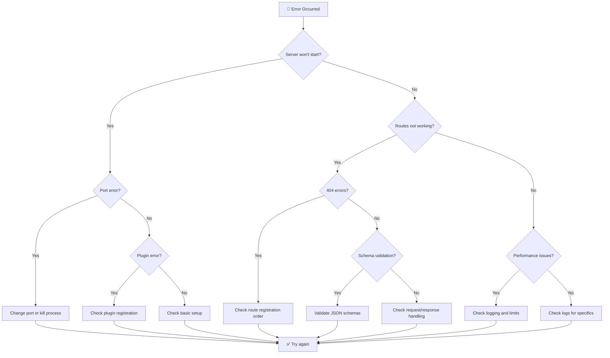

# Troubleshooting Guide

Resolve common Fastify issues quickly with this diagnostic guide.

## Common Error Messages

| Error | Cause | Solution |
|-------|-------|----------|
| `listen EADDRINUSE :::3000` | Port already in use | Change port or kill process: `lsof -ti:3000 \| xargs kill -9` |
| `Cannot read property 'addHook' of undefined` | Incorrect Fastify import | Use `require('fastify')()` not `require('fastify')` |
| `FST_ERR_PLUGIN_TIMEOUT` | Plugin registration timeout | Increase `pluginTimeout` or fix slow plugin |
| `FST_ERR_SCHEMA_ERROR` | Invalid JSON schema | Check schema syntax and types |
| `Cannot set headers after they are sent` | Response sent multiple times | Ensure only one `reply.send()` or `return` |
| `404 Not Found` for valid routes | Route registration issue | Check route order and async/await in registration |
| `request entity too large` | Request body exceeds limit | Increase `bodyLimit` or validate client payload size |
| `Unsupported Media Type` | Missing content-type parser | Register content-type parser or set correct headers |

## Error Diagnosis Flowchart



## Debugging Techniques

### 1. Enable Debug Logging

```javascript
// Method 1: Environment variable
DEBUG=fastify:* node server.js

// Method 2: Logger configuration
const fastify = require('fastify')({
  logger: {
    level: 'debug',
    transport: {
      target: 'pino-pretty',
      options: {
        colorize: true
      }
    }
  }
})
```

### 2. Plugin Debugging

```javascript
// Register plugins with error handling
try {
  await fastify.register(require('./my-plugin'), {
    // plugin options
  })
} catch (error) {
  console.error('Plugin registration failed:', error.message)
  console.error('Stack:', error.stack)
}

// Check plugin loading order
fastify.addHook('onReady', async () => {
  console.log('Registered plugins:', Object.keys(fastify.plugins))
})
```

### 3. Route Debugging

```javascript
// Log all registered routes
fastify.addHook('onReady', async () => {
  console.log('Registered routes:')
  fastify.printRoutes()
})

// Add request logging
fastify.addHook('preHandler', async (request, reply) => {
  console.log(`${request.method} ${request.url}`)
  console.log('Headers:', request.headers)
  console.log('Query:', request.query)
  console.log('Body:', request.body)
})
```

## Common Issues by Category

### Server Startup Issues

**Issue: Server won't start**
```javascript
// ❌ Common mistake
const fastify = require('fastify') // Missing ()
fastify.get('/', handler) // Error: Cannot read property 'get' of undefined

// ✅ Correct
const fastify = require('fastify')({ logger: true })
fastify.get('/', handler)
```

**Issue: Port already in use**
```bash
# Find process using port
lsof -ti:3000

# Kill process
kill -9 $(lsof -ti:3000)

# Or use different port
PORT=3001 node server.js
```

### Route Issues

**Issue: Routes not registered**
```javascript
// ❌ Missing await
fastify.register(async (fastify) => {
  fastify.get('/users', handler)
}) // Routes may not be ready

// ✅ With await
await fastify.register(async (fastify) => {
  fastify.get('/users', handler)
})
```

**Issue: Route parameters not working**
```javascript
// ❌ Wrong parameter syntax
fastify.get('/users/{id}', handler) // Wrong syntax

// ✅ Correct parameter syntax
fastify.get('/users/:id', handler)

// Access in handler
async function handler(request, reply) {
  const { id } = request.params // Correct
}
```

### Schema Validation Issues

**Issue: Schema validation errors**
```javascript
// ❌ Invalid schema
const schema = {
  body: {
    type: 'object',
    properties: {
      email: { type: 'string', format: 'email' }
    },
    required: ['email', 'nonexistent'] // Error: required field not in properties
  }
}

// ✅ Valid schema
const schema = {
  body: {
    type: 'object',
    properties: {
      email: { type: 'string', format: 'email' },
      name: { type: 'string' }
    },
    required: ['email', 'name']
  }
}
```

### Performance Issues

**Issue: Slow response times**
```javascript
// Check for synchronous operations
fastify.get('/slow', async (request, reply) => {
  // ❌ Blocking operation
  const data = fs.readFileSync('large-file.json')
  
  // ✅ Non-blocking operation
  const data = await fs.promises.readFile('large-file.json')
  return data
})
```

**Issue: Memory leaks**
```javascript
// Monitor memory usage
fastify.addHook('onRequest', async (request, reply) => {
  const used = process.memoryUsage()
  request.log.debug('Memory usage:', used)
})

// Set proper limits
const fastify = require('fastify')({
  bodyLimit: 1048576, // 1MB
  keepAliveTimeout: 5000
})
```

## Advanced Debugging

### 1. Request/Response Debugging

```javascript
// Add comprehensive request/response logging
fastify.addHook('onRequest', async (request, reply) => {
  request.startTime = Date.now()
  console.log(`→ ${request.method} ${request.url}`)
})

fastify.addHook('onResponse', async (request, reply) => {
  const duration = Date.now() - request.startTime
  console.log(`← ${reply.statusCode} ${request.method} ${request.url} (${duration}ms)`)
})

fastify.addHook('onError', async (request, reply, error) => {
  console.error(`💥 ${request.method} ${request.url}:`, error.message)
})
```

### 2. Plugin Debugging

```javascript
// Debug plugin registration order
const originalRegister = fastify.register
fastify.register = function(plugin, options) {
  console.log('Registering plugin:', plugin.name || 'anonymous')
  return originalRegister.call(this, plugin, options)
}
```

### 3. Schema Debugging

```javascript
// Validate schemas manually
const Ajv = require('ajv')
const addFormats = require('ajv-formats')

const ajv = new Ajv()
addFormats(ajv)

function validateSchema(schema, data) {
  const validate = ajv.compile(schema)
  const valid = validate(data)
  
  if (!valid) {
    console.error('Schema validation errors:', validate.errors)
  }
  
  return valid
}

// Test your schemas
const userSchema = { /* your schema */ }
const userData = { /* test data */ }
validateSchema(userSchema, userData)
```

## Performance Profiling

### 1. Enable Performance Hooks

```javascript
const { performance, PerformanceObserver } = require('perf_hooks')

// Measure request processing time
fastify.addHook('onRequest', async (request, reply) => {
  performance.mark(`${request.id}-start`)
})

fastify.addHook('onSend', async (request, reply, payload) => {
  performance.mark(`${request.id}-end`)
  performance.measure(
    `request-${request.id}`,
    `${request.id}-start`,
    `${request.id}-end`
  )
})

// Monitor performance
const obs = new PerformanceObserver((items) => {
  items.getEntries().forEach((item) => {
    console.log(`${item.name}: ${item.duration}ms`)
  })
})
obs.observe({ entryTypes: ['measure'] })
```

### 2. Memory Monitoring

```javascript
// Monitor memory every 10 seconds
setInterval(() => {
  const memUsage = process.memoryUsage()
  console.log('Memory usage:', {
    rss: `${Math.round(memUsage.rss / 1024 / 1024)} MB`,
    heapTotal: `${Math.round(memUsage.heapTotal / 1024 / 1024)} MB`,
    heapUsed: `${Math.round(memUsage.heapUsed / 1024 / 1024)} MB`,
    external: `${Math.round(memUsage.external / 1024 / 1024)} MB`
  })
}, 10000)
```

## Testing Issues

**Issue: Tests timing out**
```javascript
// Increase test timeout
const fastify = require('fastify')({
  logger: false,
  pluginTimeout: 0 // Disable timeout for tests
})

// Proper test cleanup
afterEach(async () => {
  await fastify.close()
})
```

**Issue: Test isolation**
```javascript
// Create fresh instance for each test
beforeEach(() => {
  fastify = require('fastify')({ logger: false })
})

afterEach(async () => {
  await fastify.close()
})
```

## Log Analysis

### Where to Find Logs

| Environment | Log Location | Format |
|-------------|-------------|--------|
| Development | Console output | Pretty-printed JSON |
| Production | stdout/stderr | Structured JSON |
| Docker | Container logs | `docker logs <container>` |
| Kubernetes | Pod logs | `kubectl logs <pod>` |

### Log Levels

| Level | When to Use | Example |
|-------|-------------|---------|
| `fatal` | System crash | Unrecoverable errors |
| `error` | Application errors | Failed requests, exceptions |
| `warn` | Potential issues | Deprecated features, high response times |
| `info` | General information | Server start, route registration |
| `debug` | Detailed debugging | Request details, plugin loading |
| `trace` | Very detailed debugging | Internal function calls |

## Getting Help

When reporting issues, include:

1. **Fastify version**: `npm list fastify`
2. **Node.js version**: `node --version`
3. **Environment**: Development/Production/Testing
4. **Error message**: Full error with stack trace
5. **Minimal reproduction**: Smallest code that reproduces the issue
6. **Expected vs actual behavior**

### Community Resources

- **GitHub Issues**: [fastify/fastify/issues](https://github.com/fastify/fastify/issues)
- **Discussions**: [fastify/fastify/discussions](https://github.com/fastify/fastify/discussions)
- **Discord**: [FastifyFramework](https://discord.gg/FastifyFramework)
- **Stack Overflow**: Tag with `fastify`

---

*Still stuck? Check [Configuration Guide](configuration.md) or ask the [community](https://github.com/fastify/fastify/discussions).*